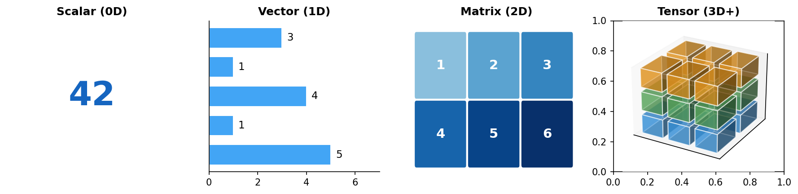
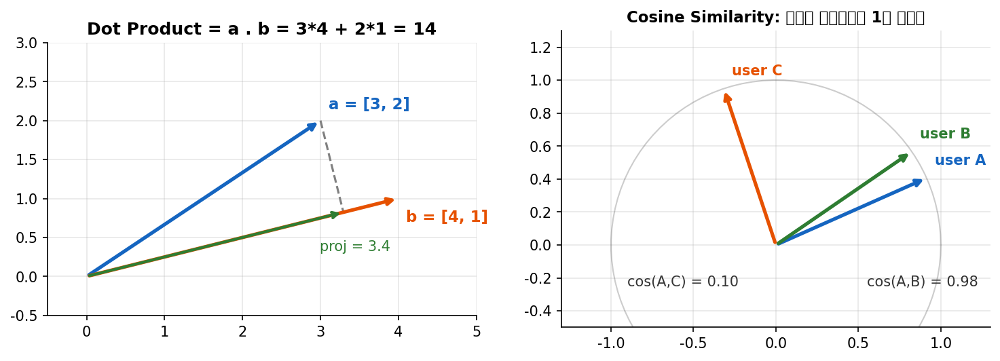
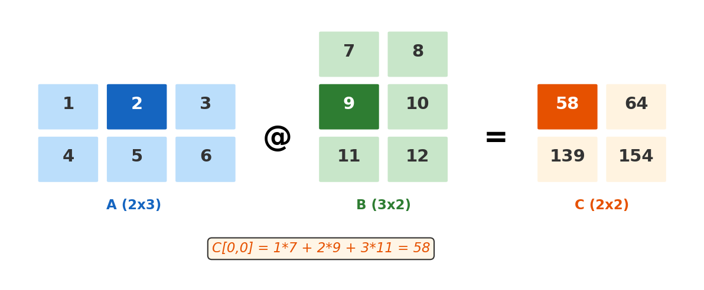
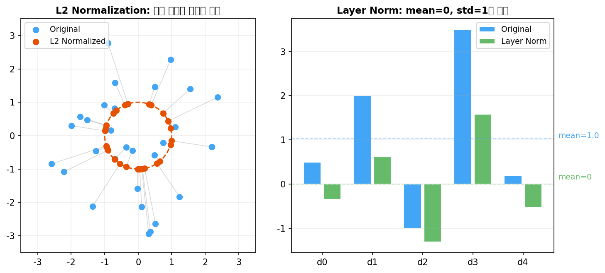
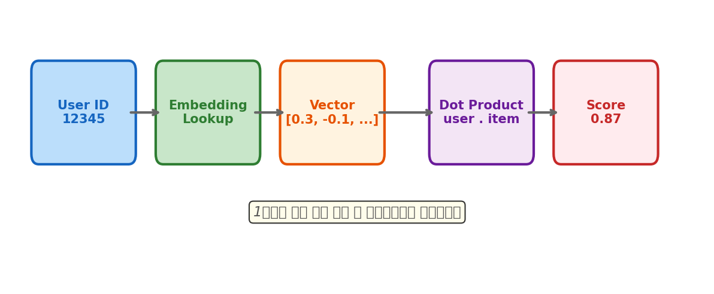

# 1장. 선형대수 기초

> 추천 시스템의 언어 -- 벡터, 행렬, 텐서로 유저와 아이템을 표현하는 법

---

## 1.1 스칼라, 벡터, 행렬, 텐서



*[그림 1-1] 스칼라 → 벡터 → 행렬 → 텐서: 차원이 하나씩 늘어난다*

> **DE 관점 비유**
> - Scalar = DataFrame의 한 셀
> - Vector = DataFrame의 한 Row
> - Matrix = 하나의 DataFrame 테이블
> - Tensor = 여러 테이블을 쌓아놓은 것 (Parquet 파티션과 유사)

### 텐서의 shape

PyTorch에서 모든 데이터는 `torch.Tensor`로 표현됩니다.

| Shape | 의미 | 코드 위치 |
|-------|------|----------|
| `(B, N, D)` | Batch × 시퀀스길이 × 임베딩차원 | Padded tensor (SASRec) |
| `(sum_i N_i, D)` | 전체시퀀스합 × 임베딩차원 | **Jagged tensor (HSTU)** |
| `(B, H, N, N)` | Batch × Head × Q길이 × K길이 | Attention score matrix |
| `(V, D)` | 어휘크기 × 임베딩차원 | Embedding table |

---

## 1.2 내적(Dot Product)과 유사도



*[그림 1-2] 왼쪽: 내적 = 한 벡터를 다른 벡터에 투영한 길이 / 오른쪽: 코사인 유사도 = 방향의 유사함*

> **HSTU 코드에서의 활용**
> - 추천 시스템에서 **유저 벡터와 아이템 벡터의 내적 = 선호도 점수**
> - `L2NormPostprocessor`: 벡터를 단위원 위로 투영 → 내적 = 코사인 유사도
> - `DotProduct` similarity: `user_emb @ item_emb.T` → 추천 점수 계산

### 1.2.3 행렬 곱셈



*[그림 1-3] 행렬 곱셈: A(2×3) @ B(3×2) = C(2×2). 행과 열의 내적.*

```python
# PyTorch에서 행렬 곱셈
import torch

A = torch.tensor([[1, 2, 3], [4, 5, 6]], dtype=torch.float)
B = torch.tensor([[7, 8], [9, 10], [11, 12]], dtype=torch.float)

C = torch.mm(A, B)        # (2,3) @ (3,2) -> (2,2)
C = A @ B                 # 동일 (연산자 오버로딩)
C = torch.bmm(A_3d, B_3d) # 배치 행렬곱 (3D 텐서)
```

---

## 1.3 정규화(Normalization)



*[그림 1-4] 왼쪽: L2 Norm (방향만 유지) / 오른쪽: Layer Norm (분포 표준화)*

| 정규화 | 수식 | HSTU 코드 |
|--------|------|----------|
| L2 Norm | `x / ‖x‖₂` | `L2NormPostprocessor` |
| Layer Norm | `(x - mean) / std` | `LayerNorm`, `_input_norm_weight` |
| Swish LN | `LN(x × σ(x))` | `SwishLayerNorm` (MLP 내부) |

---

## 1장 핵심 요약



*[그림 1-5] 추천 시스템의 핵심 흐름: ID → 벡터 → 내적 → 점수*

> **3줄 요약**
> 1. 추천 시스템은 유저와 아이템을 **벡터**로 표현하고, **내적**으로 선호도를 계산한다
> 2. **행렬곱** = 여러 내적을 한 번에 계산 (GPU가 빠른 이유)
> 3. **정규화**(L2 Norm, Layer Norm)는 학습 안정성과 유사도 계산의 핵심

---

[← 목차](../../../README.md) | [2장 →](ch02_ml_basics.md)
