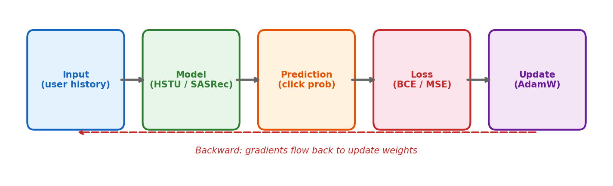
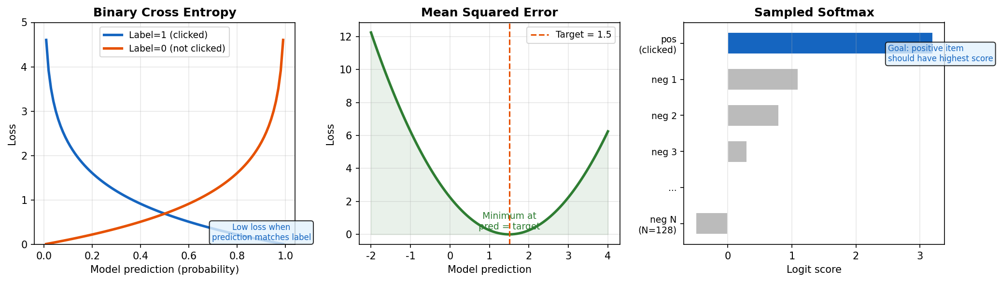
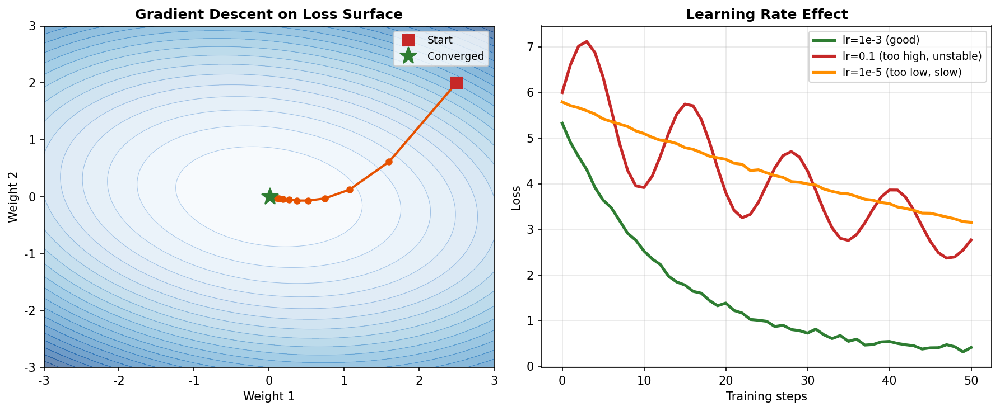
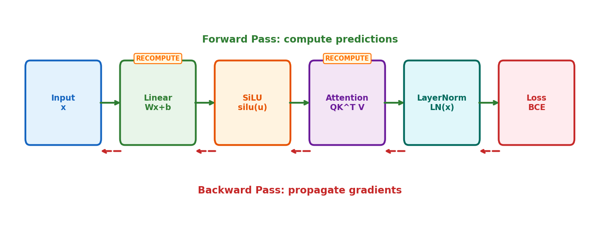
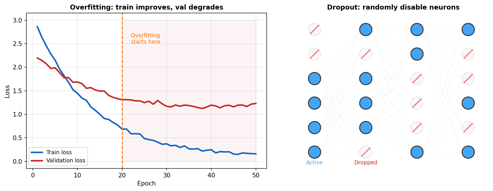

# 2장. 머신러닝 기초

> 모델이 학습하는 원리 -- Loss, Gradient, Optimizer의 동작 방식

---

## 2.1 Supervised Learning Pipeline



*[그림 2-1] Forward (predict) → Loss (measure error) → Backward (update)*

> **DE Pipeline 비유**
> - Input = HDFS raw logs
> - Model = Spark transformation (but learned, not coded)
> - Prediction = Output table
> - Loss = Data quality check ("얼마나 틀렸는가?")
> - Update = transformation 규칙을 자동으로 수정

---

## 2.2 Loss Functions



*[그림 2-2] BCE: 클릭 예측 / MSE: 시청 시간 / Sampled Softmax: 네거티브 중 랭킹*

```python
# HSTU code: MultitaskModule loss calculation
# Classification task (click/no-click)
bce_loss = F.binary_cross_entropy_with_logits(preds, labels)

# Regression task (watch time)
mse_loss = F.mse_loss(preds, labels)

# Sampled Softmax (research/modeling/sequential/autoregressive_losses.py)
logits = torch.cat([pos_logit, neg_logits], dim=-1)  # [B, 1+N]
loss = -F.log_softmax(logits / temperature, dim=-1)[:, 0]  # maximize pos
```

---

## 2.3 Gradient Descent



*[그림 2-3] 왼쪽: gradient를 따라 loss surface를 내려간다 / 오른쪽: learning rate 효과*

| Optimizer | Key Idea | HSTU Config |
|-----------|----------|-------------|
| SGD | 단순 gradient step | Not used |
| Adam | Adaptive LR + momentum | Common baseline |
| **AdamW** | Adam + decoupled weight decay | `weight_decay=1e-3` |
| LR Warmup | 시작 시 LR을 점진적으로 올림 | `num_warmup_steps` |

---

## 2.4 Backpropagation & Checkpointing



*[그림 2-4] Forward pass: 출력 계산 / Backward pass: gradient 전파. RECOMPUTE = activation checkpointing*

```python
# STU Layer config (modules/stu.py:STULayerConfig)
recompute_normed_x: bool = True   # LayerNorm 출력을 재계산
recompute_uvqk: bool = True       # U,V,Q,K projection을 재계산
recompute_y: bool = True          # Attention 출력을 재계산

# Why? 저장 대신 재계산 → GPU 메모리 ~40% 절약
```

---

## 2.5 Overfitting & Regularization



*[그림 2-5] 왼쪽: overfitting = val loss 상승 / 오른쪽: dropout으로 뉴런을 랜덤 비활성화*

| Technique | Effect | HSTU Config |
|-----------|--------|-------------|
| Dropout | 랜덤 뉴런 비활성화 | `output_dropout_ratio=0.3`, `input_dropout=0.2` |
| Weight Decay | 큰 가중치 페널티 | `weight_decay=1e-3` |
| Early Stopping | val 성능 하락 시 중단 | HR@10을 epoch마다 모니터링 |

---

## 2장 핵심 요약

> **Core Training Loop**
> 1. **Forward**: input → model → prediction
> 2. **Loss**: prediction vs label 비교 (BCE for clicks, MSE for watch time)
> 3. **Backward**: chain rule로 gradient 계산
> 4. **Update**: AdamW로 가중치 조정 (`lr=1e-3`, `weight_decay=1e-3`)
> 5. **Repeat** for `num_epochs` (HSTU config: 101)

---

[← 1장](ch01_linear_algebra.md) | [목차](../../../README.md) | [3장 →](ch03_deep_learning.md)
