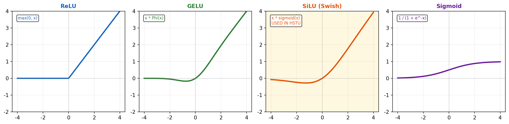
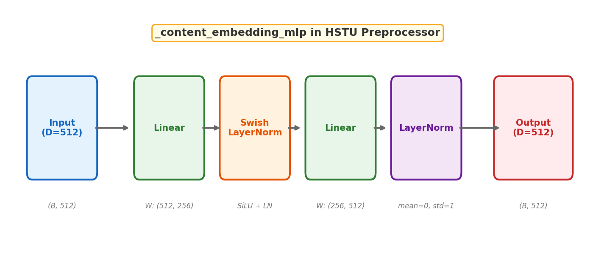
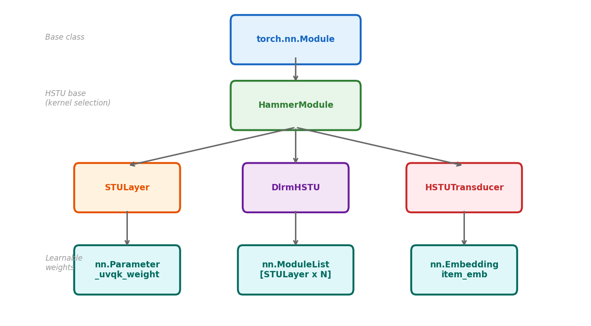
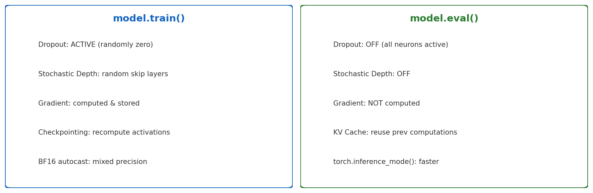
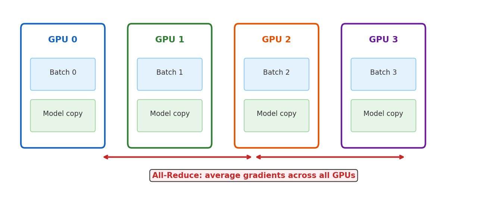

# 3장. 딥러닝 기초

> Neural Networks, Activation Functions, PyTorch Fundamentals

---

## 3.1 Activation Functions



*[그림 3-1] HSTU는 SiLU (Swish) 사용: smooth, 미분 가능, 음수값도 일부 통과*

> **Why SiLU in HSTU?**
> - `SiLU = x × sigmoid(x)`: smooth gating으로 정보 흐름을 제어
> - ReLU는 모든 음수를 죽임 → 정보 손실
> - STU Layer에서: `u = F.silu(u)` → valve처럼 정보 흐름을 조절

---

## 3.2 MLP Architecture



*[그림 3-2] HSTU Preprocessor의 MLP: Linear → SwishLayerNorm → Linear → LayerNorm*

```python
# HSTU Preprocessor MLP (modules/preprocessors.py)
_content_embedding_mlp = nn.Sequential(
    nn.Linear(input_dim, hidden_dim),     # 512 → 256
    SwishLayerNorm(hidden_dim),            # SiLU + LayerNorm
    nn.Linear(hidden_dim, output_dim),     # 256 → 512
    nn.LayerNorm(output_dim),              # normalize
)
```

---

## 3.3 PyTorch nn.Module



*[그림 3-3] HSTU 코드베이스의 PyTorch Module 계층 구조*

```python
# HSTU의 핵심 패턴
class STULayer(HammerModule):
    def __init__(self, config: STULayerConfig):
        super().__init__()
        # nn.Parameter = 학습 가능한 가중치
        self._uvqk_weight = nn.Parameter(
            torch.empty(D, (H*2 + A*2) * num_heads)
        )

    def forward(self, x, x_lengths, x_offsets, ...):
        # model(input) 호출 시 자동 실행
        u, attn, k, v = hstu_preprocess_and_attention(...)
        return hstu_compute_output(attn, u, x, ...)
```

---

## 3.4 Training vs Inference Mode



*[그림 3-4] Training과 Inference의 핵심 차이점*

---

## 3.5 Distributed Data Parallel (DDP)



*[그림 3-5] DDP: 각 GPU가 다른 배치를 처리하고, gradient를 평균*

```python
# HSTU DDP setup (main.py)
num_gpus = torch.cuda.device_count()  # e.g., 4
mp.spawn(train_fn, args=(num_gpus, master_port),
         nprocs=num_gpus)  # GPU당 1 process

# Inside train_fn:
dist.init_process_group("nccl", rank=rank, world_size=world_size)
model = DDP(model, device_ids=[rank])
```

---

## 3장 핵심 요약

> 1. Neural Network = Linear + Activation 레이어의 스택
> 2. HSTU는 **SiLU gating** 사용 (표준 softmax 대신) → 정보 흐름 제어
> 3. PyTorch: `nn.Module` + `nn.Parameter` + `forward()` = 모든 모델의 기본 블록

---

[← 2장](ch02_ml_basics.md) | [목차](../../../README.md) | [4장 →](ch04_embedding.md)
