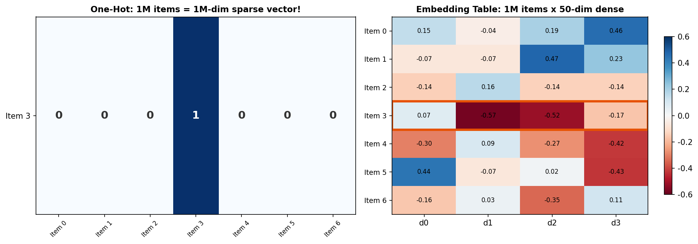
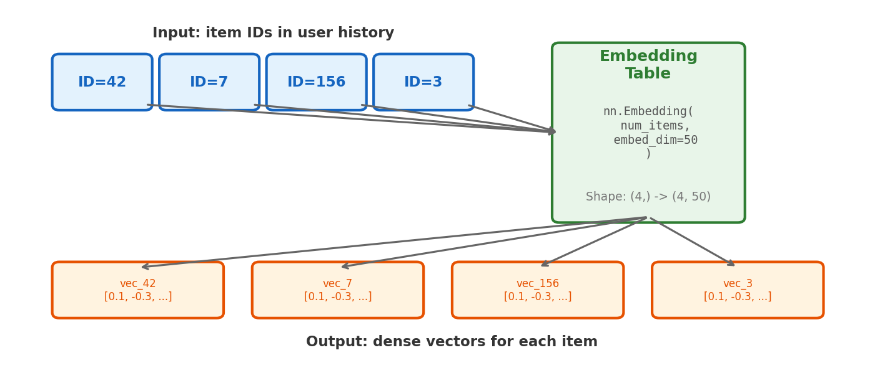
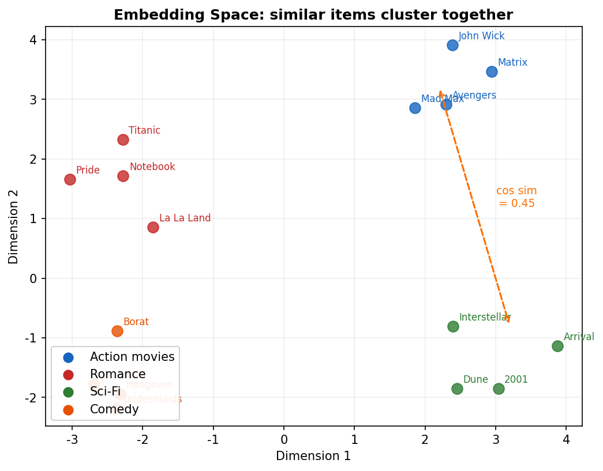
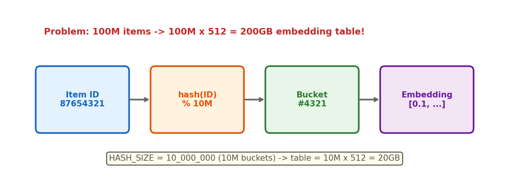

# 4장. Embedding

> Discrete IDs to Dense Vectors -- 추천 시스템의 기반

---

## 4.1 One-Hot vs Embedding



*[그림 4-1] One-Hot: sparse, huge / Embedding: dense, compact. Lookup = table[item_id]*

---

## 4.2 Embedding Lookup



*[그림 4-2] Embedding Lookup: ID가 들어가면 dense vector가 나온다. 연산 없이 테이블 조회.*

```python
# HSTU embedding (research/modeling/sequential/embedding_modules.py)
class LocalEmbeddingModule(EmbeddingModule):
    def __init__(self, num_items, item_embedding_dim):
        self._item_emb = nn.Embedding(
            num_items + 1,
            item_embedding_dim,
            padding_idx=0  # ID=0 means "no item"
        )

    def get_item_embeddings(self, item_ids):
        return self._item_emb(item_ids)  # [B, N] → [B, N, D]
```

---

## 4.3 Learned Embedding Space



*[그림 4-3] 학습 후 임베딩이 자동으로 조직화된다. 비슷한 아이템 = 가까운 벡터.*

---

## 4.4 Large-Scale: Hash Embedding



*[그림 4-4] Hash Embedding: 100M 아이템을 10M 버킷에 매핑. 일부 충돌이 있지만 10배 메모리 절약.*

| Config | Embedding Dim | Hash Size |
|--------|---------------|-----------|
| Research (ML-1M) | 50 | ~4K items (no hash) |
| Research (ML-20M) | 50 | ~27K items (no hash) |
| DLRMv3 (small) | 512 | `HASH_SIZE = 10M` |
| DLRMv3 (large) | 512 | `HASH_SIZE_1B = 1B` |

```python
# DLRMv3 Embedding Config (dlrm_v3/configs.py)
EmbeddingConfig(
    name="item_id",
    embedding_dim=HSTU_EMBEDDING_DIM,  # 512
    num_embeddings=HASH_SIZE,           # 10_000_000
    data_type=DataType.FP16,            # half precision → 메모리 절반
)
```

---

## 4장 핵심 요약

> 1. **Embedding** = ID를 dense vector로 매핑하는 lookup table
> 2. 학습이 진행되면 비슷한 아이템이 **가까운 벡터**로 모인다
> 3. **Hash trick**: 100M 아이템 → 10M 버킷 매핑 (충돌 OK)
> 4. HSTU는 `TorchRec EmbeddingCollection`으로 분산 임베딩 처리

---

[← 3장](ch03_deep_learning.md) | [목차](../../../README.md) | [5장 →](ch05_attention.md)
