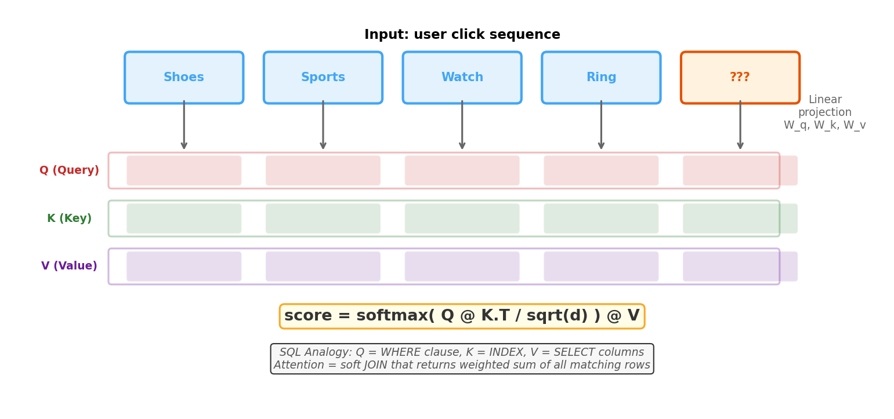
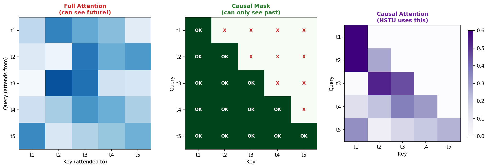
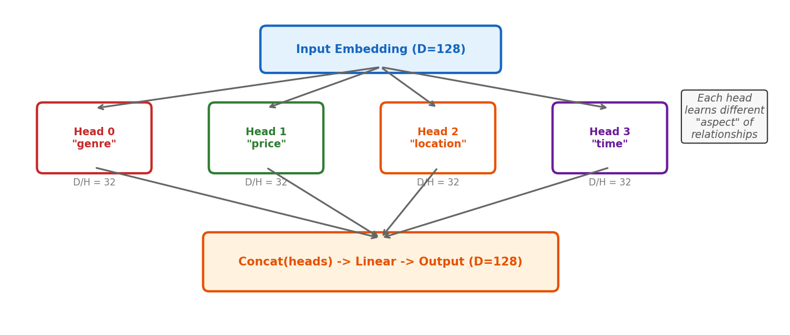
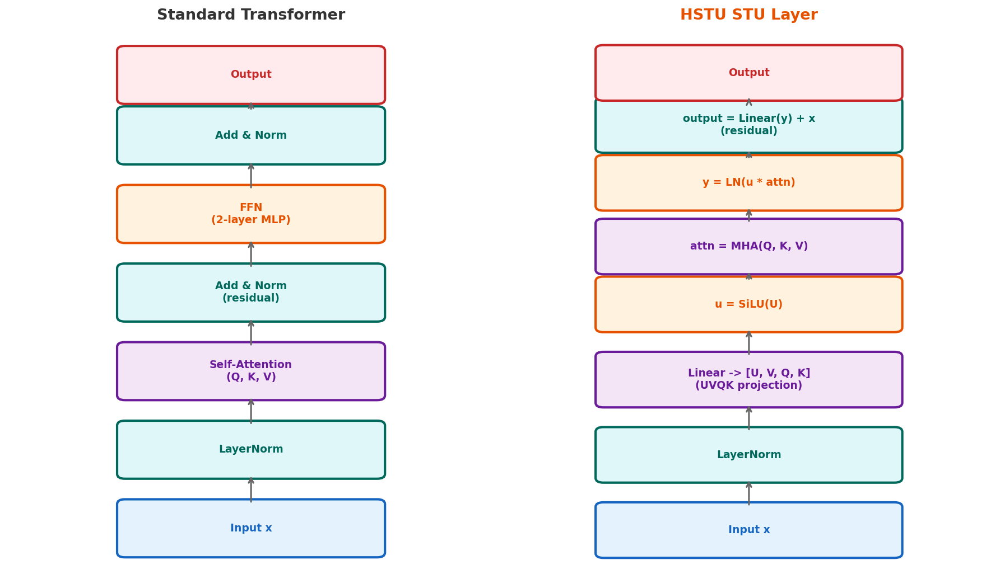
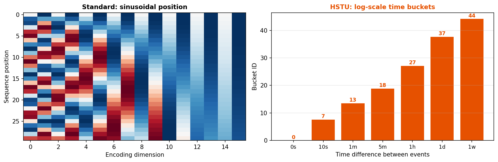

# 5장. Attention Mechanism

> Self-Attention에서 Transformer까지 -- HSTU를 이해하기 위한 핵심

---

## 5.1 Self-Attention: QKV



*[그림 5-1] Self-Attention: 각 토큰이 다른 모든 토큰에 "질의"하여 관련 정보를 가져온다*

> **SQL 비유**
> - **Q (Query)** = WHERE 조건절
> - **K (Key)** = INDEX (각 행의 매칭 키)
> - **V (Value)** = SELECT 컬럼
> - **Attention** = soft JOIN: 모든 매칭 행의 weighted sum을 반환

---

## 5.2 Causal Masking



*[그림 5-2] Causal masking: t3는 t1,t2,t3만 참조 가능. t4,t5는 볼 수 없다.*

> **Why Causal?**
> - 추천 = 다음 클릭 예측
> - User viewed: shoes → sports → watch → **???**
> - **???** 을 예측할 때 미래 정보를 참조하면 안 됨
> - Causal mask가 이를 강제: `causal=True` (STULayerConfig)

---

## 5.3 Multi-Head Attention



*[그림 5-3] Multi-Head: D를 H개 head로 분할, 각각 독립 attention, 결과를 concat*

| Config | num_heads | D_total | D_per_head |
|--------|-----------|---------|------------|
| Research (small) | 2 | 50 | 25 |
| Research (large) | 2 | 50 | 25 |
| DLRMv3 | 4 | 512 | 128 |

---

## 5.4 Transformer Block vs STU Layer



*[그림 5-4] 핵심 차이: HSTU는 FFN을 SiLU gating (u × attn)으로 대체. 파라미터↓, 표현력 유지.*

> **STU Layer vs Transformer: 3가지 핵심 차이**
> 1. **UVQK** (4개 projection) vs QKV (3개) → U가 gating 역할
> 2. **SiLU(U) × Attention**이 FFN을 대체 → 2-layer MLP 대신 gating
> 3. **상대적 시간+위치 인코딩** vs 절대 위치 인코딩

---

## 5.5 Positional Encoding



*[그림 5-5] 왼쪽: 표준 sinusoidal (고정 패턴) / 오른쪽: HSTU는 log-bucketed 시간 차이 사용*

```python
# HSTU time bucketization (research/modeling/sequential/hstu.py)
bucketization_fn = lambda x: (
    torch.log(torch.abs(x).clamp(min=1)) / 0.301
).long()

# 0.301 = log(2), 즉 bucket = log2(time_diff)
# 10초 → bucket 3, 1시간 → bucket 12, 1주 → bucket 20
```

---

## 5장 핵심 요약

> 1. **Attention** = soft lookup: Q가 질문, K가 매칭, V가 정보 반환
> 2. **Causal masking**: 과거만 참조 (next-item prediction에 필수)
> 3. **Multi-head**: 여러 "관점"에서 동시에 attention
> 4. **HSTU STU Layer**: FFN 대신 SiLU gating (더 효율적)
> 5. **시간 인코딩**: log-bucketed 시간 차이로 "최신성"과 "주기성" 포착

---

[← 4장](ch04_embedding.md) | [목차](../../../README.md) | [6장 →](ch06_recsys.md)
