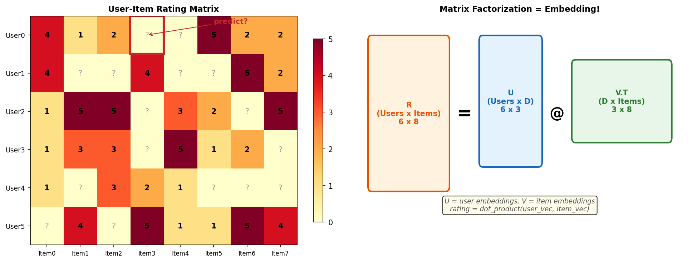
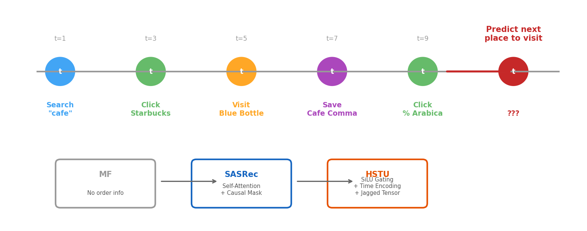
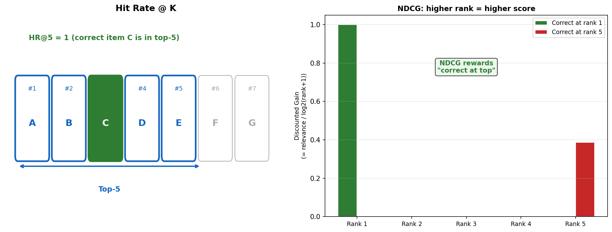
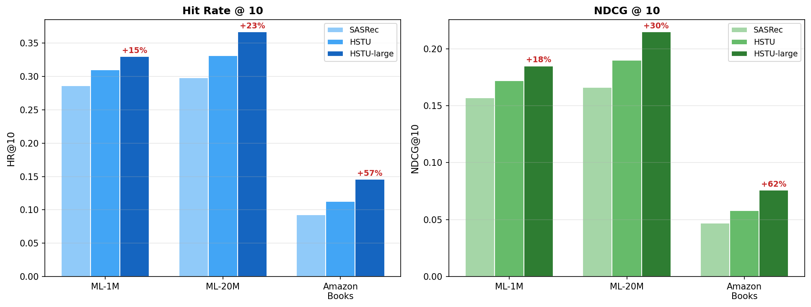
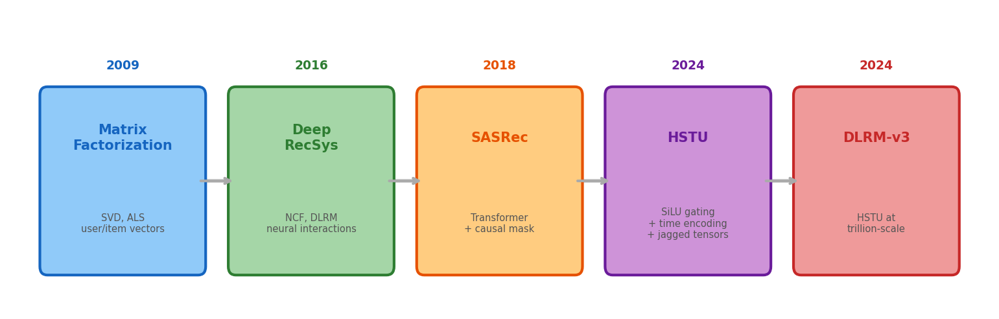

# 6장. 추천 시스템 기초

> Collaborative Filtering에서 Sequential Recommendation까지 -- 진화의 역사

---

## 6.1 Collaborative Filtering & Matrix Factorization

*[그림 6-1] 왼쪽: sparse 평점 행렬 / 오른쪽: user & item 임베딩으로 분해. 이것이 임베딩의 기원!*

---

## 6.2 Sequential Recommendation

*[그림 6-2] 순서와 시간이 중요하다. HSTU는 short-term (최근 클릭)과 long-term (선호) 패턴을 동시에 포착.*

> **Place Service 매핑**
> - User sequence: search → click → visit → save → click → **???**
> - HSTU `ActionEncoder`: 행동 TYPE을 인코딩 (search=1, click=2, visit=4, save=8)
> - HSTU `TimestampEncoder`: 각 행동의 시간 차이를 포착
> - `Target-Aware Attention`: 후보 장소 정보를 반영하여 이력을 인코딩

---

## 6.3 Evaluation Metrics

*[그림 6-3] HR@K: 정답이 top K에 있나? (binary) / NDCG@K: 정답이 얼마나 높은 순위인가? (위치 가중)*

| Metric | 의미 | HSTU benchmark |
|--------|------|---------------|
| **HR@10** | 정답이 top-10에 포함? | HSTU-large: **+56.7%** vs SASRec |
| **NDCG@10** | 위치 가중 추천 품질 | HSTU-large: **+60.7%** vs SASRec |
| MRR | 첫 정답의 역순위 평균 | eval loop에서 리포트 |
| GAUC | 유저별 Group AUC | DLRMv3 프로덕션 메트릭 |

---

## 6.4 HSTU Benchmark Results

*[그림 6-4] HSTU-large가 모든 데이터셋에서 SASRec을 큰 폭으로 앞선다.*

---

## 6.5 Evolution of RecSys Models

*[그림 6-5] MF (2009) → Deep RecSys (2016) → SASRec (2018) → HSTU (2024) → DLRM-v3 (production)*

---

## 6장 핵심 요약 & Part 1 마무리

> **Part 1에서 배운 것 총정리**
> 1. **CF + MF** = 임베딩의 기원 (user/item 벡터 + 내적)
> 2. **Sequential 모델**은 유저 행동의 순서를 포착
> 3. **SASRec** = Transformer를 RecSys에 적용 (baseline)
> 4. **HSTU** = SiLU gating + 시간 인코딩 + jagged tensors (SOTA)
> 5. **평가**: HR@K (맞았나?), NDCG@K (순위가 높은가?)
>
> **이제 HSTU 코드를 이해할 모든 기초 지식을 갖추었습니다!**
> Part 2에서 아키텍처를 심층 분석합니다.

---

[← 5장](ch05_attention.md) | [목차](../../../README.md)
