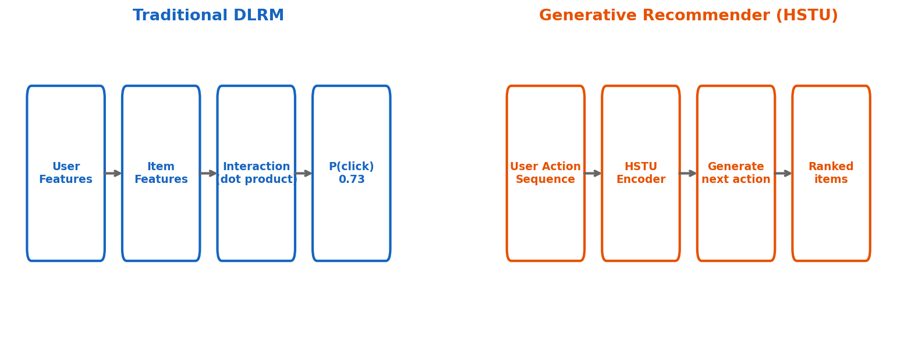
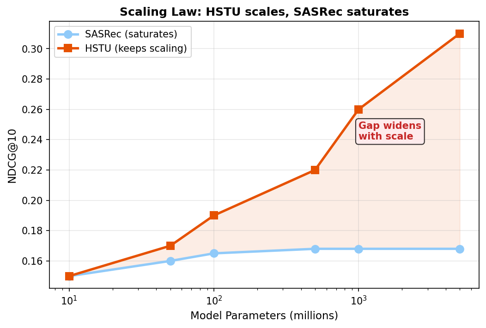
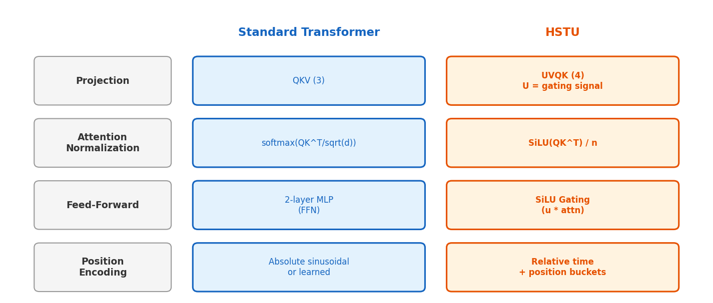

# 7장. 논문 개요

> "Actions Speak Louder than Words" -- ICML 2024

---

## 7.1 DLRM vs Generative Recommender



*[그림 7-1] 왼쪽: 전통 DLRM (피처 → 상호작용 → 클릭확률) / 오른쪽: HSTU (행동 시퀀스 → 인코딩 → 다음 행동 생성)*

### 패러다임 전환

| | Traditional DLRM | Generative Recommender (HSTU) |
|---|---|---|
| **입력** | 유저 피처 + 아이템 피처 (정적) | 유저 행동 시퀀스 (동적) |
| **모델링** | "이 유저가 이 아이템을 클릭할 확률?" | "이 시퀀스의 다음 행동은?" |
| **스케일링** | 임베딩 테이블 크기에 의존 | **모델 파라미터 수에 비례** (scaling law) |
| **장점** | 단순, 검증됨 | short/long-term 선호 동시 포착 |

---

## 7.2 Scaling Law



*[그림 7-2] SASRec은 파라미터를 늘려도 성능이 정체. HSTU는 계속 향상 (trillion-parameter까지).*

> **핵심 발견**
> - 기존 추천 모델(SASRec 등)은 모델 크기를 키워도 성능이 **포화(saturate)**
> - HSTU는 **Scaling Law**를 따름: 파라미터↑ → 성능↑ (LLM과 동일한 현상)
> - Meta에서 **10억 유저** 프로덕션 환경에서 최초로 확인

---

## 7.3 Transformer vs HSTU: 4가지 핵심 차이



*[그림 7-3] 표준 Transformer와 HSTU의 4가지 구조적 차이*

```python
# 차이 1: UVQK projection (4개, not 3개)
u, v, q, k = torch.split(uvqk, [H*heads, H*heads, A*heads, A*heads], dim=1)
u = F.silu(u)  # U = gating signal

# 차이 2: SiLU attention (not softmax)
qk_attn = F.silu(qk_attn) / n  # smooth gating, allows negatives

# 차이 3: Gating replaces FFN
output = concat(u, attn, u * attn)  # u gates the attention

# 차이 4: Relative time + position buckets
bucket = (torch.log(time_diff.clamp(min=1)) / 0.301).long()
```

---

## 7장 핵심 요약

> 1. **추천 = 생성 문제**로 재정의: 다음 행동을 "생성"
> 2. **Scaling Law**: HSTU는 파라미터↑ → 성능↑ (SASRec은 정체)
> 3. **4가지 핵심 차이**: UVQK, SiLU attention, gating(no FFN), 시간 인코딩
> 4. 결과: SASRec 대비 **HR@10 최대 +56.7%**, **NDCG@10 최대 +60.7%**

---

[← 6장](../part1/ch06_recsys.md) | [목차](../../README.md) | [8장 →](ch08_hstu_architecture.md)
