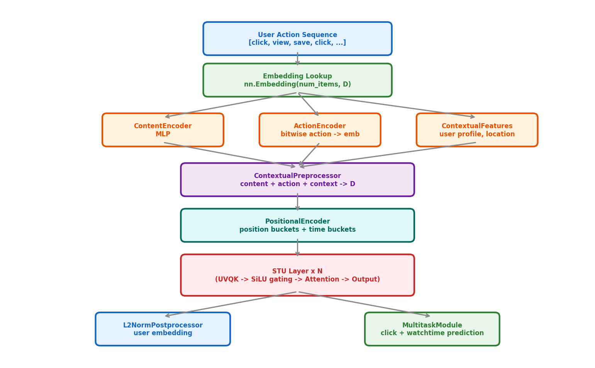
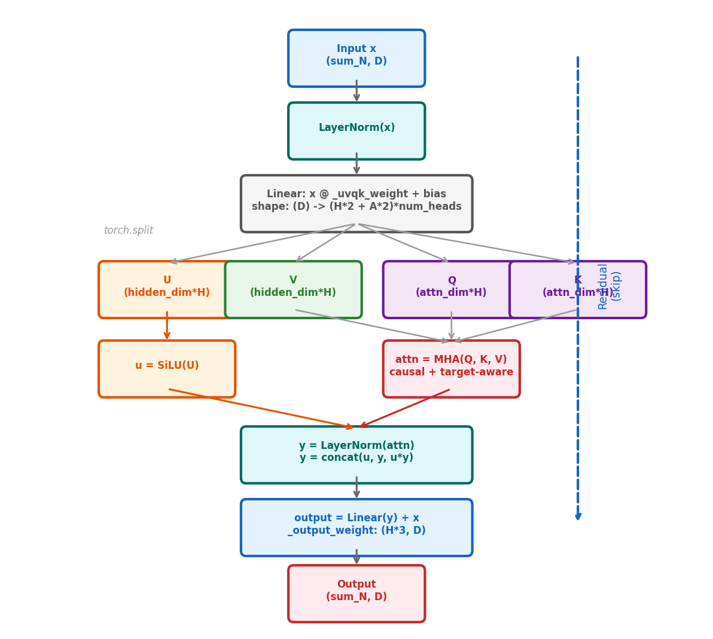
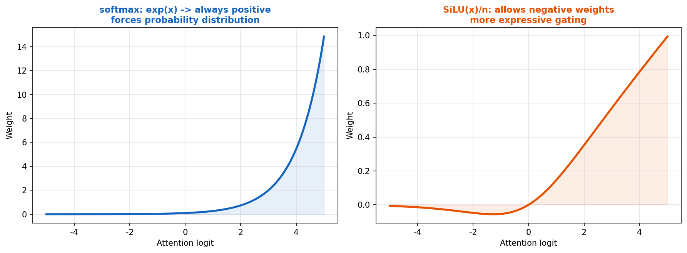
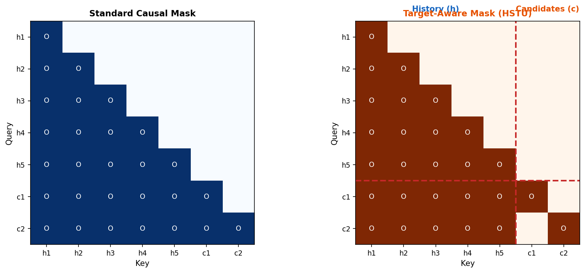

# 8장. HSTU 아키텍처 상세 분석

> STU Layer, Target-Aware Attention, Preprocessor/Postprocessor

---

## 8.1 전체 데이터 흐름



*[그림 8-1] HSTU 전체 데이터 흐름: 행동 시퀀스 → 임베딩 → 전처리 → STU Layers → 후처리 → 예측*

---

## 8.2 STU Layer 상세



*[그림 8-2] STU Layer의 전체 순전파. 핵심: UVQK 분리 → SiLU gating → concat(u, attn, u×attn)*

### 가중치 파라미터

```python
# modules/stu.py:STULayer.__init__
_uvqk_weight: (embedding_dim, (hidden_dim*2 + attention_dim*2) * num_heads)
_uvqk_beta:   ((hidden_dim*2 + attention_dim*2) * num_heads,)
_input_norm_weight/bias: (embedding_dim,)
_output_weight: (hidden_dim * num_heads * 3, embedding_dim)  # *3 for concat(u, attn, u*attn)
_output_norm_weight/bias: (hidden_dim * num_heads,)
```

### 순전파 수식

```
1. normed_x = LayerNorm(x)
2. [U, V, Q, K] = normed_x @ _uvqk_weight + bias
3. u = SiLU(U)                          # gating signal
4. Q = reshape(Q, [num_heads, attn_dim])
5. K = reshape(K, [num_heads, attn_dim])
6. V = reshape(V, [num_heads, hidden_dim])
7. attn = MHA(Q, K, V)                  # multi-head attention
8. y = LayerNorm(attn)
9. y = concat(u, y, u * y)              # gated output
10. output = y @ _output_weight + x      # residual connection
```

### UVQK 계산 코드

```python
# ops/hstu_compute.py:hstu_compute_uqvk
normed_x = layer_norm(x, weight=norm_weight, bias=norm_bias)
uvqk = addmm(uvqk_bias, normed_x, uvqk_weight)       # (sum_N, D) @ (D, UVQK) -> (sum_N, UVQK)
u, v, q, k = torch.split(uvqk, [H*heads, H*heads, A*heads, A*heads], dim=1)
u = F.silu(u)                                          # SiLU gating
q = q.view(-1, num_heads, attn_dim)                    # reshape for MHA
k = k.view(-1, num_heads, attn_dim)
v = v.view(-1, num_heads, hidden_dim)
```

---

## 8.3 SiLU Attention (Not Softmax!)



*[그림 8-3] softmax: 항상 양수, 확률 분포 강제 / SiLU: 음수 허용, 더 유연한 gating*

```python
# research/modeling/sequential/hstu.py (line 203-210)
qk_attn = torch.einsum("bnhd,bmhd->bhnm",
    padded_q.view(B, n, num_heads, attention_dim),
    padded_k.view(B, n, num_heads, attention_dim))

qk_attn = F.silu(qk_attn) / n          # NOT softmax!
qk_attn = qk_attn * causal_mask         # apply masking

attn_output = torch.einsum("bhnm,bmhd->bnhd", qk_attn, V)
```

> **Why SiLU instead of softmax?**
> - softmax는 모든 가중치를 양수로 강제 → "무관한 아이템에도 약간의 attention"
> - SiLU는 **음수 가중치** 허용 → "무관한 아이템을 적극적으로 억제"
> - `/n` 나누기: sequence 길이에 따른 정규화 (softmax의 temperature 역할)

---

## 8.4 Target-Aware Attention



*[그림 8-4] 왼쪽: 표준 causal mask / 오른쪽: Target-Aware — candidate는 전체 history를 볼 수 있음*

### 비대칭 마스킹 규칙

| Query \ Key | History (h) | Candidates (c) |
|---|---|---|
| **History (h)** | Causal (과거만) | X (미래 불가) |
| **Candidates (c)** | **ALL history 참조 가능** | Self만 |

```python
# UIH + candidates를 하나의 시퀀스로 결합
combined = concat_2D_jagged(uih_embeddings, candidate_embeddings)
# num_targets = 후보 아이템 수 (어텐션 마스크 변경에 사용)
output = hstu_transducer(combined, num_targets=num_candidates)
```

> **Target-Aware의 효과**
> - 후보 장소가 "이 유저의 어떤 이력에 주목할지" 직접 결정
> - 장소추천 예시: 후보 "한남동 카페" → 유저의 카페 방문 이력에 집중, 음식점 이력은 무시

---

## 8.5 Preprocessor & Postprocessor

### ContextualPreprocessor

```
Content Embedding MLP:  raw_emb → Linear → SwishLN → Linear → LN → D
Action Encoder:         action_bitmask → bitwise_and → action_embedding_table → D
Contextual Features:    user_profile → batched_linear → prepend to sequence
```

### Postprocessor 종류

| Postprocessor | 수식 | 용도 |
|---|---|---|
| `L2NormPostprocessor` | `x / ‖x‖₂` | 코사인 유사도 기반 retrieval |
| `LayerNormPostprocessor` | `LN(x)` | 일반적 정규화 |
| `TimestampLayerNormPostprocessor` | `LN(x + time_features)` | 시간대/요일별 패턴 반영 |

---

## 8.6 Multi-Task Module

```python
# modules/multitask_module.py
prediction = user_embedding * item_embedding     # element-wise
prediction = _prediction_module(prediction)      # Linear(D,512) → SwishLN → Linear(512, num_tasks)

# Task별 loss
for task in tasks:
    if task.type == BINARY_CLASSIFICATION:
        loss = F.binary_cross_entropy_with_logits(pred, label)
    elif task.type == REGRESSION:
        loss = F.mse_loss(pred, label)
    total_loss += causal_multitask_weights * loss  # weight = 0.2
```

---

## 8장 핵심 요약

> 1. **STU Layer**: `UVQK → SiLU(U) → MHA(Q,K,V) → concat(u, attn, u*attn) → Linear + residual`
> 2. **SiLU attention**: softmax 대신 `SiLU(QK^T)/n` → 음수 가중치 허용, 무관한 정보 억제
> 3. **Target-Aware**: 후보 아이템이 유저 전체 이력을 참조 (비대칭 마스킹)
> 4. **Preprocessor**: Content MLP + Action Encoder + Contextual Features 결합
> 5. **Multi-task**: 클릭(BCE) + 시청시간(MSE)을 동시 학습

---

[← 7장](ch07_paper_overview.md) | [목차](../../README.md) | [9장 →](ch09_jagged_tensor.md)
