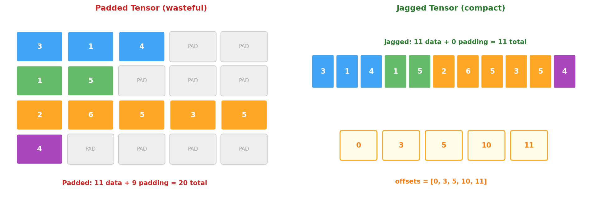
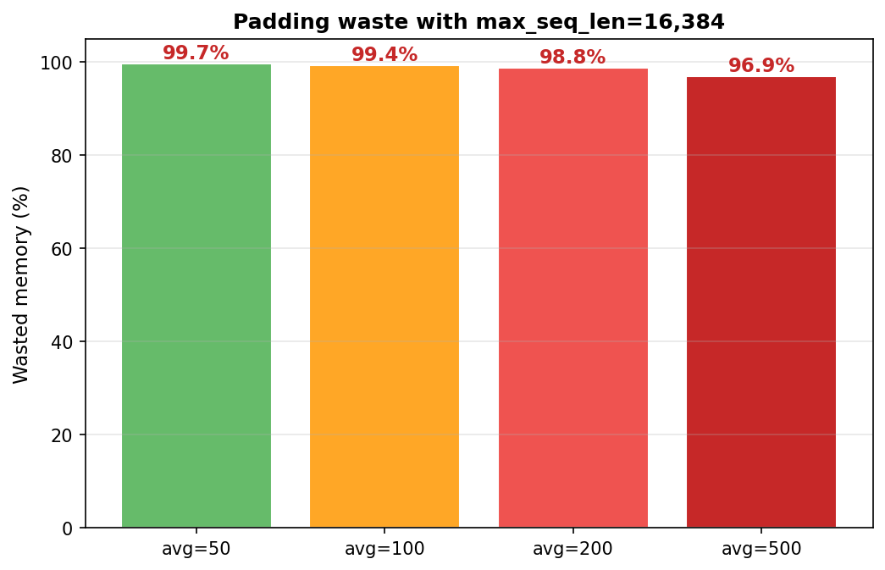
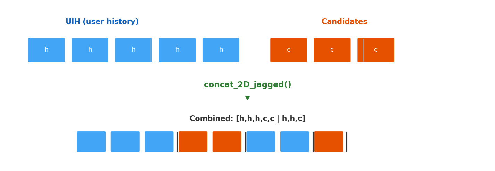

# 9장. Jagged Tensor

> HSTU의 효율성 핵심 -- padding 없이 가변 길이 시퀀스 처리

---

## 9.1 Padding의 문제



*[그림 9-1] 왼쪽: Padded — PAD 셀이 메모리와 연산을 낭비 / 오른쪽: Jagged — 데이터만 저장, 0% 낭비*

---

## 9.2 메모리 낭비 규모



*[그림 9-2] max_seq_len=16,384일 때, 평균 시퀀스 길이 100이면 **99.4%가 padding 낭비***

> **실무 시나리오**
> - 대부분의 유저: 최근 50~200개 행동
> - 소수의 heavy user: 수천~수만 개 행동
> - max_seq_len=16,384로 설정하면 → **대부분의 메모리가 padding**
> - Jagged tensor: 필요한 만큼만 할당 → GPU HBM 절약

---

## 9.3 Jagged Tensor 구조

### values + offsets 표현

```python
# 4명의 유저, 시퀀스 길이: [3, 2, 5, 1]
# Padded: shape (4, 5, D) → 20 * D 메모리
# Jagged: shape (11, D) + offsets → 11 * D 메모리

values = torch.tensor([               # (sum_N, D) = (11, D)
    [v0], [v1], [v2],                 # user 0: 3 items
    [v3], [v4],                       # user 1: 2 items
    [v5], [v6], [v7], [v8], [v9],     # user 2: 5 items
    [v10],                            # user 3: 1 item
])

lengths = torch.tensor([3, 2, 5, 1])
offsets = torch.ops.fbgemm.asynchronous_complete_cumsum(lengths)
# offsets = [0, 3, 5, 10, 11]
# user i의 데이터 = values[offsets[i]:offsets[i+1]]
```

---

## 9.4 핵심 연산: concat & split



*[그림 9-3] concat_2D_jagged: UIH + Candidates를 유저별로 이어붙임 → HSTU에 입력*

```python
# ops/jagged_tensors.py
# UIH + Candidates 결합 (Target-Aware Attention 입력 생성)
combined = concat_2D_jagged(
    values_left=uih_embeddings,         # user history
    values_right=candidate_embeddings,  # candidates
    offsets_left=uih_offsets,
    offsets_right=candidate_offsets,
)

# 인코딩 후 다시 분리
uih_encoded, candidate_encoded = split_2D_jagged(
    values=encoded,
    offsets_left=uih_offsets,
    offsets_right=candidate_offsets,
)
```

---

## 9.5 커널 구현: 3단계

| Level | Implementation | Performance | 사용 시점 |
|-------|---------------|-------------|----------|
| `HammerKernel.PYTORCH` | 순수 PyTorch | Baseline | 디버깅, CPU |
| `HammerKernel.TRITON` | Triton GPU kernel | ~10x faster | 일반 GPU 학습 |
| `HammerKernel.CUDA` | C++ CUDA kernel | ~100x faster | H100 프로덕션 |

```python
# common.py - 런타임 커널 선택
class HammerKernel(Enum):
    PYTORCH = 0    # Reference implementation
    TRITON = 1     # Triton auto-tuned
    CUDA = 2       # FlashAttention V3 based
    TRITON_CC = 3  # Triton Compiler optimized
    TLX = 4        # Blackwell architecture
```

> **DE 관점**: Spark에서 DataFrame 연산이 내부적으로 Tungsten/Code generation으로 최적화되는 것과 유사.
> 사용자 코드는 동일하지만, 실행 엔진이 하드웨어에 맞게 자동 선택됨.

---

## 9장 핵심 요약

> 1. **Padded tensor**: max_len으로 패딩 → 99%+ 메모리 낭비 가능
> 2. **Jagged tensor**: `values (sum_N, D)` + `offsets (B+1,)` → 0% 낭비
> 3. **concat_2D_jagged**: UIH + Candidates를 유저별로 결합 (Target-Aware 입력)
> 4. **split_2D_jagged**: 인코딩 후 candidate 임베딩만 추출
> 5. **3단계 커널**: PyTorch → Triton → CUDA (성능 10~100x 향상)

---

[← 8장](ch08_hstu_architecture.md) | [목차](../../README.md)
