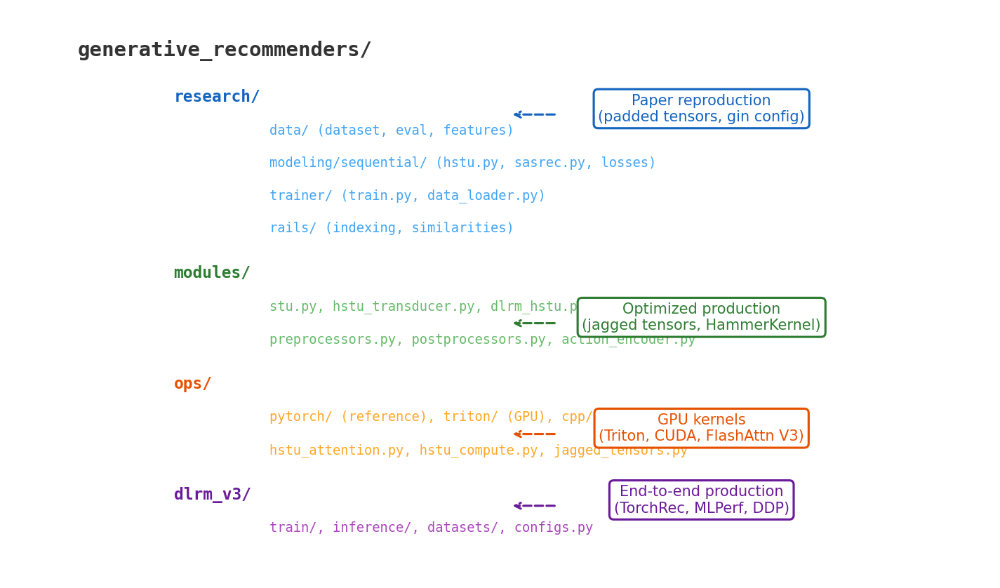

# 10장. 레포지토리 구조와 코드 컨벤션

---

## 10.1 디렉토리 구조



*[그림 10-1] 4개 레벨: research (논문재현) → modules (최적화) → ops (GPU커널) → dlrm_v3 (프로덕션)*

| 디렉토리 | 역할 | Tensor 타입 | 대상 |
|----------|------|------------|------|
| `research/` | 논문 재현, 실험 | Padded | 연구자 |
| `modules/` | 최적화된 모델 | **Jagged** | 엔지니어 |
| `ops/` | GPU 커널 (Triton/CUDA) | Jagged | GPU 전문가 |
| `dlrm_v3/` | E2E 프로덕션 | Jagged + TorchRec | 프로덕션 |

---

## 10.2 주요 의존성

```
torch>=2.6.0          # PyTorch (핵심)
fbgemm_gpu>=1.1.0     # Meta GPU 최적화 (jagged tensor ops)
torchrec>=1.1.0       # Meta 추천 라이브러리 (분산 임베딩)
gin_config>=0.5.0     # Google 설정 프레임워크
```

> **DE 관점**: Spark의 Catalyst optimizer처럼, HSTU는 같은 로직을 여러 백엔드(PyTorch/Triton/CUDA)로 실행 가능.
> `HammerKernel` enum이 런타임에 최적 커널을 선택.

---

## 10.3 코드 컨벤션

```python
# 1. HammerModule: 모든 모듈의 기반 클래스
class STULayer(HammerModule):  # not nn.Module

# 2. @torch.fx.wrap: 모델 트레이싱/컴파일 지원
@torch.fx.wrap
def _update_kv_cache(...):

# 3. record_function: 프로파일링 마커
with record_function("hstu_attention"):

# 4. Gin configuration: 하이퍼파라미터 주입
@gin.configurable
def train_fn(rank, world_size, master_port, dataset_name="ml-1m", ...):
```

---

[← 9장](../part2/ch09_jagged_tensor.md) | [목차](../../README.md) | [11장 →](ch11_data_pipeline.md)
