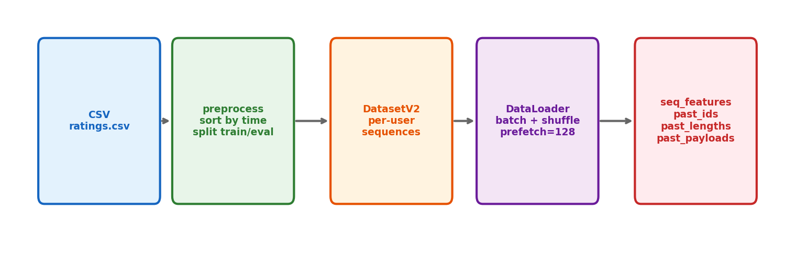

# 11장. 데이터 파이프라인

---

## 11.1 전체 흐름



*[그림 11-1] CSV → 전처리 → Dataset → DataLoader → Features*

---

## 11.2 데이터 전처리

```bash
# 1단계: 데이터 다운로드 + 변환
mkdir -p tmp/
python3 preprocess_public_data.py

# 결과:
# tmp/ml-1m/ratings.csv     (userId, movieId, rating, timestamp)
# tmp/ml-20m/ratings.csv
# tmp/amzn-books/ratings.csv
```

## 11.3 Dataset 클래스

```python
# research/data/dataset.py
class DatasetV2:
    def __init__(self, ratings_file, item_features_file=None):
        self._data = pd.read_csv(ratings_file)
        # 유저별로 그룹화하여 시퀀스 구성 (시간순)

# research/data/reco_dataset.py
train_dataset = RecoDataset(data, ignore_last_n=1)  # 마지막=target
eval_dataset  = RecoDataset(data, ignore_last_n=0)  # 전체 사용
```

## 11.4 Feature Engineering

```python
# research/modeling/sequential/features.py
def movielens_seq_features_from_row(row, max_length):
    return SequentialFeatures(
        past_ids=row["movie_ids"][-max_length:],    # 아이템 ID 시퀀스
        past_lengths=len(past_ids),                  # 시퀀스 길이
        past_payloads={
            "timestamps": row["timestamps"],          # 행동 시간
            "ratings": row["ratings"],                # 평점
        },
    )
```

> **Spark ETL 비유**
> - `preprocess_public_data.py` = raw data ingestion job
> - `DatasetV2` = Spark DataFrame partitioned by user_id
> - `movielens_seq_features_from_row` = UDF that transforms each row
> - `DataLoader(prefetch_factor=128)` = Spark의 broadcast + coalesce

---

[← 10장](ch10_repo_structure.md) | [목차](../../README.md) | [12장 →](ch12_core_modules.md)
