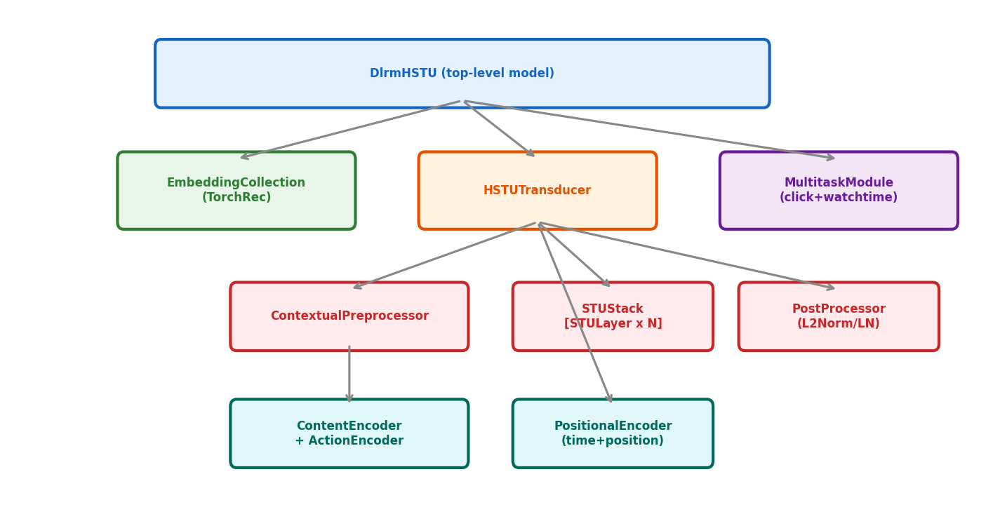

# 12장. 핵심 모듈 코드 분석

---

## 12.1 모듈 구성도



*[그림 12-1] DlrmHSTU가 최상위. 하위에 Embedding, Transducer, Multitask이 조합됨.*

---

## 12.2 STULayer (`modules/stu.py`)

### 가중치 Shape 정리

| Parameter | Shape | 역할 |
|-----------|-------|------|
| `_uvqk_weight` | `(D, (H*2+A*2)*heads)` | UVQK 한번에 계산 |
| `_uvqk_beta` | `((H*2+A*2)*heads,)` | UVQK bias |
| `_input_norm_weight/bias` | `(D,)` | LayerNorm |
| `_output_weight` | `(H*heads*3, D)` | concat(u,attn,u*attn) → D |
| `_output_norm_weight/bias` | `(H*heads,)` | Output LayerNorm |

### forward 핵심 코드

```python
def forward(self, x, x_lengths, x_offsets, max_seq_len, num_targets, ...):
    # Step 1: UVQK + Attention (fused)
    u, attn, k, v = hstu_preprocess_and_attention(
        x, self._input_norm_weight, self._input_norm_bias,
        self._uvqk_weight, self._uvqk_beta, ...)

    # Step 2: KV Cache update (for inference)
    self.k_cache, self.v_cache, ... = _update_kv_cache(...)

    # Step 3: Output = LN(attn) * u → concat → Linear + residual
    return hstu_compute_output(
        attn, u, x, self._output_norm_weight, self._output_norm_bias,
        self._output_weight, ...)
```

---

## 12.3 HSTUTransducer (`modules/hstu_transducer.py`)

```
forward(x, ...) =
  1. _preprocess: InputPreprocessor → PositionalEncoder → Dropout
  2. _hstu_compute: STUStack.forward(x) → N layers of STULayer
  3. _postprocess: split_2D_jagged → OutputPostprocessor
  → returns (candidate_embeddings, full_embeddings)
```

---

## 12.4 DlrmHSTU (`modules/dlrm_hstu.py`)

```
main_forward(x, ...) =
  1. preprocess: EmbeddingCollection → KeyedJaggedTensor lookup
  2. _user_forward: concat UIH+candidates → HSTUTransducer → user_emb
  3. _item_forward: concat item features → item_embedding_mlp → item_emb
  4. MultitaskModule: user_emb * item_emb → predictions + losses
```

---

[← 11장](ch11_data_pipeline.md) | [목차](../../README.md) | [13장 →](ch13_low_level_ops.md)
