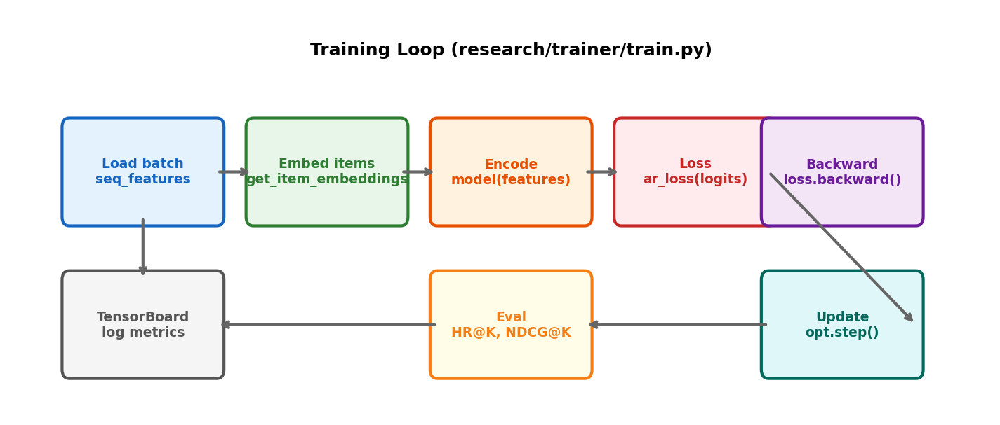

# 14장. Research 코드 워크스루

---

## 14.1 Training Loop



*[그림 14-1] Research 학습 루프: batch → embed → encode → loss → backward → update → eval*

### train_fn 전체 구조

```python
@gin.configurable
def train_fn(rank, world_size, master_port,
             dataset_name="ml-1m", max_sequence_length=200,
             local_batch_size=128, main_module="HSTU",
             learning_rate=1e-3, num_epochs=101, ...):

    # 1. DDP 초기화
    setup(rank, world_size, master_port)

    # 2. 데이터 로드
    dataset, eval_dataset = get_reco_dataset(dataset_name)
    train_loader = create_data_loader(dataset, batch_size, ...)

    # 3. 모델 생성
    model = get_sequential_encoder(main_module, ...)  # HSTU or SASRec
    model = DDP(model, device_ids=[rank])

    # 4. Loss + Sampler
    ar_loss = SampledSoftmaxLoss(num_negatives, temperature, ...)
    sampler = LocalNegativesSampler(num_items, item_emb, ...)

    # 5. Training loop
    for epoch in range(num_epochs):
        for batch in train_loader:
            features = movielens_seq_features_from_row(batch, max_length)
            user_emb = model(features)
            loss = ar_loss(user_emb, item_emb, sampler)
            loss.backward()
            optimizer.step()

        # 6. Evaluation
        if epoch % eval_interval == 0:
            hr, ndcg, mrr = eval_metrics_v2_from_tensors(...)
            writer.add_scalar("hr@10", hr)
```

---

## 14.2 Gin Config 해석

```ini
# configs/ml-1m/hstu-sampled-softmax-n128-large-final.gin
train_fn.dataset_name = "ml-1m"
train_fn.max_sequence_length = 200      # 최근 200개 행동
train_fn.local_batch_size = 128         # GPU당 128 시퀀스
train_fn.main_module = "HSTU"           # (or "SASRec" for baseline)
train_fn.item_embedding_dim = 50        # 아이템 벡터 차원
train_fn.dropout_rate = 0.2

hstu_encoder.num_blocks = 8             # STU Layer 8개 스택
hstu_encoder.num_heads = 2              # 2-head attention
hstu_encoder.dqk = 25                   # Query/Key dim per head
hstu_encoder.dv = 25                    # Value dim per head

train_fn.loss_module = "SampledSoftmaxLoss"
train_fn.num_negatives = 128            # 128개 네거티브 샘플
train_fn.temperature = 0.05             # Softmax temperature
train_fn.learning_rate = 1e-3           # AdamW learning rate
```

---

## 14.3 SASRec vs HSTU 코드 비교

| 측면 | SASRec | HSTU |
|------|--------|------|
| Attention | `softmax(QK^T/sqrt(d))` | `SiLU(QK^T)/n` |
| FFN | `Conv1D → ReLU → Conv1D` | `SiLU(U) × attn` (gating) |
| Linear | QKV (3 projections) | UVQK (4 projections) |
| Time encoding | None | `RelativeBucketedTimeAndPositionBasedBias` |
| Config | `sasrec-sampled-softmax-n128-final.gin` | `hstu-sampled-softmax-n128-large-final.gin` |

---

[← 13장](ch13_low_level_ops.md) | [목차](../../README.md) | [15장 →](ch15_dlrmv3_production.md)
