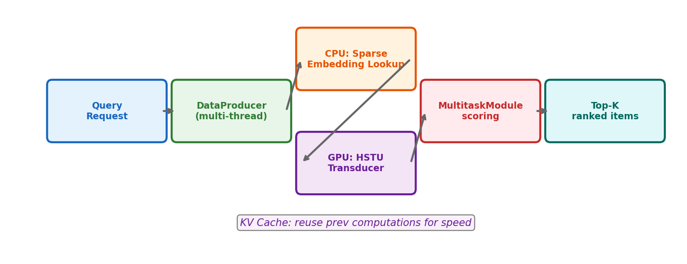

# 15장. DLRMv3 프로덕션 코드

---

## 15.1 학습 진입점

```bash
# 4-GPU 학습
LOCAL_WORLD_SIZE=4 WORLD_SIZE=4 python3 \
  generative_recommenders/dlrm_v3/train/train_ranker.py \
  --dataset movielens-1m --mode train
```

## 15.2 추론 파이프라인



*[그림 15-1] CPU에서 임베딩 조회 → GPU에서 HSTU 인코딩 → 점수 계산 → Top-K 반환*

### KV Caching

```python
# modules/stu.py:STULayer.cached_forward
def cached_forward(self, delta_x, num_targets, ...):
    # 새 토큰의 UVQK만 계산
    u, q, k, v = hstu_compute_uqvk(delta_x, ...)

    # 이전 캐시 + 새 KV 결합
    full_k, full_v, ... = _construct_full_kv(
        delta_k=k, delta_v=v,
        k_cache=self.k_cache, v_cache=self.v_cache, ...)

    # 새 Q로 전체 KV에 attention
    attn = delta_hstu_mha(delta_q=q, k=full_k, v=full_v, ...)
    return hstu_compute_output(attn, u, delta_x, ...)
```

> **KV Cache 효과**: 시퀀스 길이 N일 때
> - Without cache: O(N²) attention per request
> - With cache: O(N) per new token (이전 KV 재사용)

---

## 15.3 Research vs DLRMv3 비교

| 측면 | Research | DLRMv3 |
|------|----------|--------|
| Tensor | Padded | Jagged |
| Embedding | `nn.Embedding` | `TorchRec EmbeddingCollection` |
| Config | Gin (simple) | Gin + dataclass |
| Training | Single script | `train_ranker.py` (4 modes) |
| Inference | None | MLPerf loadgen |
| KV Cache | Limited | Full support |

---

[← 14장](ch14_research_code.md) | [목차](../../README.md) | [16장 →](../part4/ch16_environment.md)
