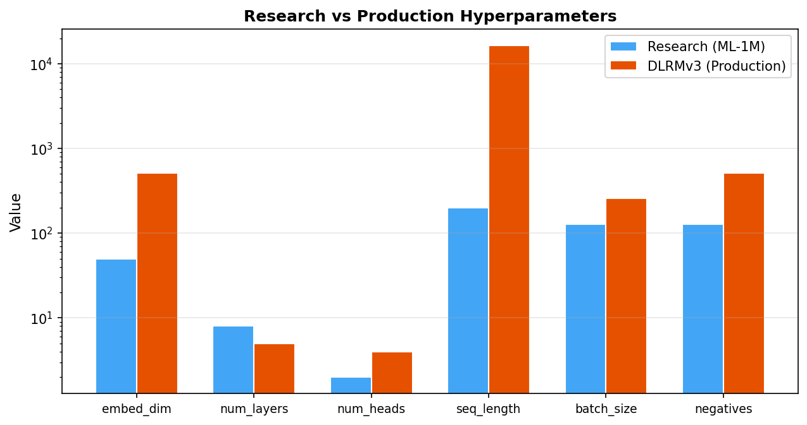

# 17장. 하이퍼파라미터 튜닝 가이드

---

## 17.1 Research vs Production



*[그림 17-1] Research (ML-1M)와 Production (DLRMv3)의 하이퍼파라미터 차이 (log scale)*

---

## 17.2 아키텍처 파라미터

| 파라미터 | Research | Production | 영향 |
|----------|----------|------------|------|
| `item_embedding_dim` | 50 | 512 | 표현력↑, 메모리↑ |
| `num_blocks` (layers) | 8 | 5 | 깊이↑ = 복잡 패턴, 학습 느림 |
| `num_heads` | 2 | 4 | 관점↑, 연산↑ |
| `dqk` (Q/K dim) | 25 | 128 | attention 해상도↑ |
| `max_sequence_length` | 200 | 16,384 | 장기 이력↑, 메모리↑ |

## 17.3 학습 파라미터

| 파라미터 | 값 | 효과 |
|----------|---|------|
| `learning_rate` | 1e-3 | 너무 높으면 불안정, 너무 낮으면 느림 |
| `weight_decay` | 0 ~ 1e-3 | 과적합 방지 |
| `num_negatives` | 128 ~ 512 | ↑ = 더 정확한 loss, 더 느린 학습 |
| `temperature` | 0.05 | ↓ = hard negative에 집중 |
| `dropout_rate` | 0.2 | ↑ = 강한 정규화 |
| `num_warmup_steps` | 0 | >0이면 학습 초기 안정성↑ |

## 17.4 튜닝 가이드

```
Step 1: 작은 모델로 빠르게 실험
  → ML-1M + HSTU (not large) + 30 epochs

Step 2: 학습률 탐색
  → lr = [5e-4, 1e-3, 2e-3] 비교

Step 3: 모델 크기 조절
  → num_blocks = [4, 6, 8], num_heads = [1, 2, 4]

Step 4: 정규화 조절
  → dropout = [0.1, 0.2, 0.3], weight_decay = [0, 1e-4, 1e-3]

Step 5: 대규모 데이터로 확장
  → ML-20M → Amazon Books → 자체 데이터
```

---

[← 16장](ch16_environment.md) | [목차](../../README.md) | [18장 →](ch18_practical_application.md)
