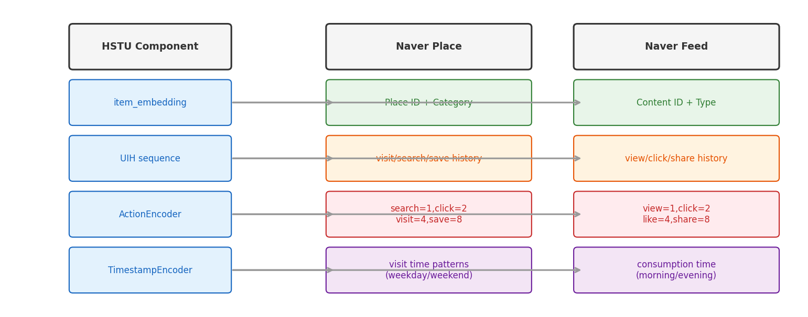

# 18장. 실무 적용 전략

---

## 18.1 HSTU → 실무 매핑



*[그림 18-1] HSTU 컴포넌트를 장소추천/콘텐츠피드에 매핑*

---

## 18.2 콘텐츠피드 초개인화

### 데이터 파이프라인 설계

```
HDFS (user action logs)
  → Spark ETL (시간순 정렬, 시퀀스 구성)
  → Parquet (train/eval split)
  → HSTU DataLoader
  → GPU Training (Argo Workflow)
  → Model Checkpoint → Feature Store (user embeddings)
```

### Multi-Task 설정

```python
tasks = [
    TaskConfig(name="click", task_weight=2, task_type=BINARY_CLASSIFICATION),
    TaskConfig(name="dwell_time", task_weight=1, task_type=REGRESSION),
    TaskConfig(name="share", task_weight=4, task_type=BINARY_CLASSIFICATION),
]
# causal_multitask_weights = 0.2 (auxiliary loss weight)
```

---

## 18.3 장소추천 랭커 개선

### HSTU의 장점

| Feature | 활용 |
|---------|------|
| `TimestampEncoder` | 방문 시점 패턴 (평일 점심 vs 주말 저녁) |
| `ActionEncoder` | 검색/클릭/방문/저장 행동 구분 |
| `Target-Aware Attention` | 후보 장소가 관련 이력에 집중 |
| `Multi-Task` | 클릭 + 방문 + 저장 동시 예측 |

### TimestampLayerNormPostprocessor

```python
# 시간대/요일별 추천 패턴 학습
time_duration_features = [
    (3600, 24),   # 시간대 (24시간 주기)
    (86400, 7),   # 요일 (7일 주기)
]
# → sin/cos 인코딩으로 주기적 패턴 포착
```

---

## 18.4 유저 페르소나

```python
# HSTU 인코더를 페르소나 생성기로 활용
user_embeddings = model.encode(user_sequence)  # (B, D)
# → 이 벡터를 Feature Store에 저장
# → 세그먼테이션, 타겟팅, 개인화에 활용

# Argo Workflow: 주기적 배치 추론
# 1. HDFS에서 최신 유저 시퀀스 로드
# 2. HSTU 인코더로 임베딩 생성
# 3. Feature Store 업데이트
```

---

## 18.5 인프라 설계

```
┌─────────────────────────────────────────────┐
│  Argo Workflow (N3R Kubernetes)              │
│                                             │
│  ┌─────────┐  ┌──────────┐  ┌───────────┐  │
│  │ Spark   │→│ GPU      │→│ Feature   │  │
│  │ ETL     │  │ Training │  │ Store     │  │
│  │ (HDFS)  │  │ (DDP x4) │  │ (serving) │  │
│  └─────────┘  └──────────┘  └───────────┘  │
│                                             │
│  Monitoring: TensorBoard + Grafana          │
│  Metrics: HR@K, NDCG@K → CTR, dwell_time   │
└─────────────────────────────────────────────┘
```

---

## 18장 핵심 요약 & 전체 마무리

> **즉시 적용 가능한 패턴**
> 1. `ActionEncoder`: 다중 행동 유형을 비트마스크로 인코딩
> 2. `TimestampEncoder`: 시간 패턴 포착 (log-bucket)
> 3. `Target-Aware Attention`: 후보가 이력에서 관련 정보를 직접 조회
> 4. `Multi-Task`: 클릭 + 체류시간 + 공유를 동시 학습
> 5. `Jagged Tensor`: 가변 길이 시퀀스의 메모리 효율적 처리

> **어렵거나 불필요한 부분**
> - Triton/CUDA 커널 직접 작성 (fbgemm_gpu 라이브러리 활용으로 충분)
> - Trillion-parameter 스케일링 (현재 규모에서는 불필요)
> - MLPerf 벤치마크 통합 (내부 벤치마크 체계 사용)

---

[← 17장](ch17_hyperparameters.md) | [목차](../../README.md)
