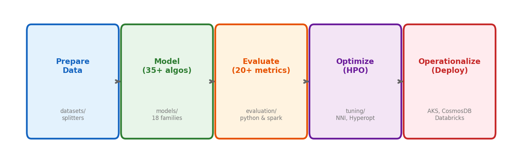
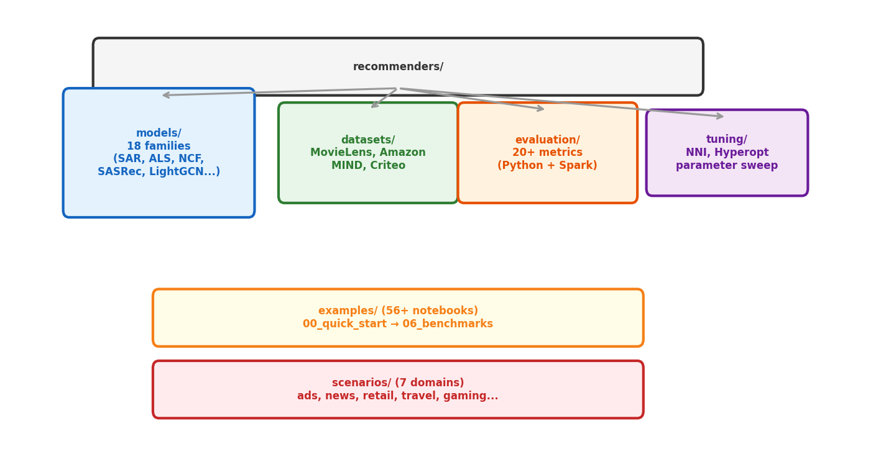

# 1장. 라이브러리 아키텍처

> recommenders-team/recommenders -- 35+ 알고리즘, 20+ 메트릭, 56+ 노트북

---

## 1.1 5가지 Core Task



*[그림 1-1] Recommenders 라이브러리의 5단계 워크플로우*

| Task | 디렉토리 | 핵심 기능 |
|------|---------|----------|
| **Prepare Data** | `datasets/`, `examples/01_*` | MovieLens/Amazon/MIND 로딩, train/test 분할 |
| **Model** | `models/` (18 families) | 35+ 알고리즘 학습 |
| **Evaluate** | `evaluation/` | 20+ 메트릭 (rating, ranking, diversity) |
| **Optimize** | `tuning/` | NNI, Hyperopt, AzureML Hyperdrive |
| **Operationalize** | `examples/05_*` | AKS, Cosmos DB, Databricks 배포 |

---

## 1.2 라이브러리 구조



*[그림 1-2] recommenders/ 핵심 모듈 구조*

## 1.3 설치

```bash
# 빠른 설치 (uv 권장)
uv pip install recommenders

# GPU 모델 포함
uv pip install "recommenders[gpu]"

# Spark 알고리즘 포함
uv pip install "recommenders[spark]"

# 전체 설치
uv pip install "recommenders[all]"
```

| Extra | 포함 | 대표 알고리즘 |
|-------|------|-------------|
| core | NumPy, Pandas, scikit-learn | SAR, TF-IDF |
| `[gpu]` | TensorFlow, PyTorch | NCF, SASRec, LightGCN |
| `[spark]` | PySpark 3.3+ | ALS |
| `[experimental]` | LightFM, Surprise, VW | SVD, BPR |

---

[목차](../README.md) | [2장 →](ch02_algorithms_map.md)
