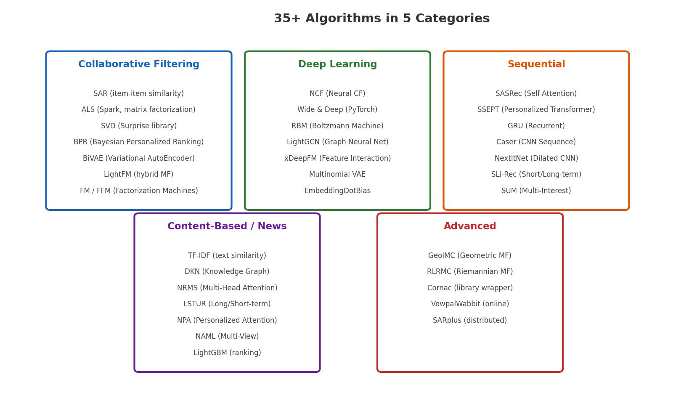
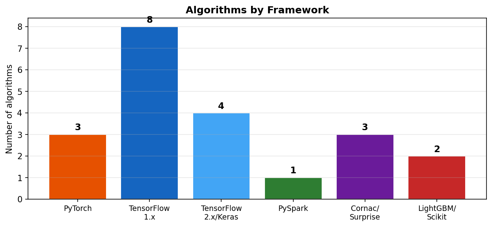

# 2장. 30+ 알고리즘 지도

---

## 2.1 카테고리별 알고리즘

*[그림 2-1] 5개 카테고리, 30+ 알고리즘. 각 카테고리의 대표 알고리즘을 표시.*

---

## 2.2 프레임워크별 분포

*[그림 2-2] TensorFlow 1.x 기반이 가장 많고, PyTorch (SASRec, Wide&Deep 등)가 성장 중*

---

## 2.3 알고리즘 선택 가이드

| 상황 | 추천 알고리즘 | 이유 |
|------|-------------|------|
| **빠른 베이스라인** | SAR | 0.23초 학습, implicit feedback, 높은 정확도 |
| **정확도 최우선** | BiVAE, BPR | Precision@10 최고 (0.41, 0.39) |
| **시퀀스 패턴** | SASRec | Transformer 기반, HSTU의 baseline |
| **그래프 관계** | LightGCN | User-Item 그래프 구조 활용 |
| **콘텐츠 기반** | NRMS, DKN | 뉴스/기사 추천 (텍스트 활용) |
| **대규모 분산** | ALS (Spark) | PySpark 기반 수억 레코드 처리 |
| **CTR 예측** | xDeepFM, LightGBM | Feature interaction, 랭킹 최적화 |

> **HSTU 스터디 연결**
> - SASRec이 이 라이브러리에도 구현되어 있음 → HSTU의 baseline
> - 이 라이브러리의 SASRec (`models/sasrec/`) vs HSTU의 SASRec (`research/modeling/sequential/sasrec.py`) 비교 가능
> - HSTU 논문의 "SASRec 대비 +56.7% HR@10" 결과를 이 라이브러리로 재현/검증 가능

---

## 2.4 알고리즘 × 데이터 유형 매트릭스

| Algorithm | Explicit Rating | Implicit Feedback | Sequential | Content Features |
|-----------|:-:|:-:|:-:|:-:|
| SAR | | O | | |
| ALS | O | O | | |
| SVD | O | | | |
| BPR | | O | | |
| NCF | | O | | |
| Wide&Deep | | O | | O |
| SASRec | | O | O | |
| LightGCN | | O | | |
| NRMS | | O | | O |
| LightGBM | | O | | O |

---

[← 1장](ch01_overview.md) | [목차](../README.md) | [3장 →](ch03_quick_benchmark.md)
