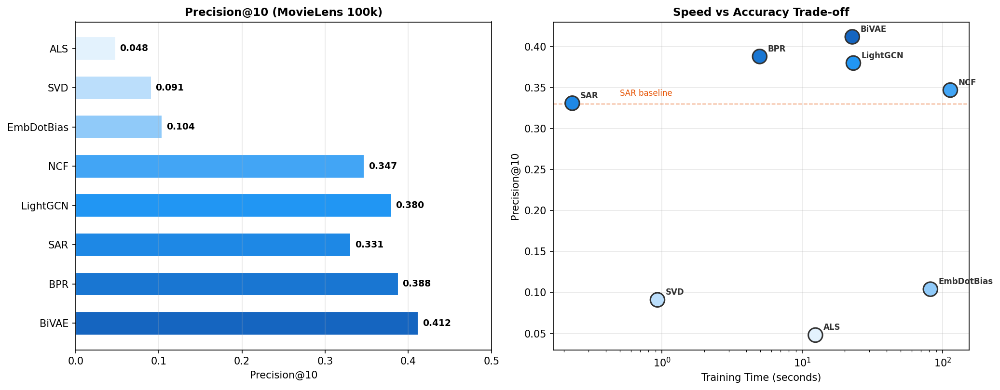
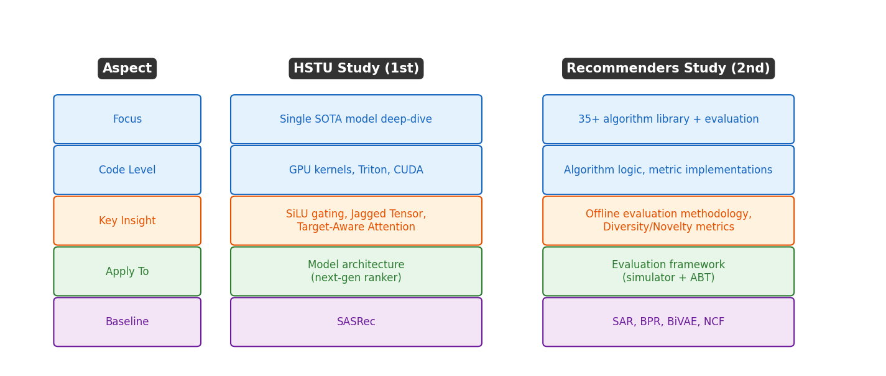

# 3장. 벤치마크 결과 해석

---

## 3.1 MovieLens 100k 벤치마크



*[그림 3-1] 왼쪽: Precision@10 순위 / 오른쪽: 학습시간 vs 정확도 트레이드오프*

### 결과 요약

| Algorithm | Precision@10 | NDCG@10 | MAP | Train Time |
|-----------|:-----------:|:-------:|:---:|:----------:|
| **BiVAE** | **0.411** | **0.471** | **0.144** | 22.7s |
| BPR | 0.388 | 0.443 | 0.132 | 5.0s |
| LightGCN | 0.359 | 0.416 | 0.089 | 23.1s |
| NCF | 0.327 | 0.369 | 0.095 | 113.3s |
| **SAR** | 0.331 | 0.394 | 0.111 | **0.23s** |
| SVD | 0.091 | 0.094 | 0.013 | 0.93s |
| ALS | 0.048 | 0.033 | 0.005 | 12.4s |

> *Note: 벤치마크 수치는 `examples/06_benchmarks/movielens.ipynb` 기준. 실행 환경에 따라 소폭 변동 가능.*

> **Key Insights**
> - **BiVAE** = 정확도 1위, but SAR 대비 100배 느림
> - **SAR** = 최고의 가성비 (0.23초에 Precision 0.33)
> - **NCF** = 가장 느림 (113초), 정확도는 중간
> - **ALS** = Spark용이라 소규모 데이터에서는 오히려 불리

---

## 3.2 HSTU 스터디와의 비교



*[그림 3-2] 두 스터디의 초점과 적용 영역 비교*

### 같은 알고리즘, 다른 관점

```
SASRec in Recommenders Library:
  - PyTorch 기반 깔끔한 구현
  - MovieLens/Amazon 데이터 노트북 제공
  - 다른 알고리즘과 동일 조건 비교 가능

SASRec in HSTU Repo:
  - HSTU의 baseline으로만 사용
  - Gin config로 하이퍼파라미터 관리
  - HSTU-large 대비 -56.7% HR@10 (열등)

→ Recommenders의 SASRec으로 베이스라인 구축
→ HSTU 아키텍처로 개선 효과 측정
→ ABT framework에서 이 비교를 자동화
```

---

## 3.3 벤치마크 재현 방법

```python
# examples/06_benchmarks/movielens.ipynb 기반
from recommenders.datasets import movielens
from recommenders.datasets.python_splitters import python_stratified_split
from recommenders.evaluation.python_evaluation import (
    map_at_k, ndcg_at_k, precision_at_k, recall_at_k
)

# 1. 데이터 로드 + 분할
data = movielens.load_pandas_df(size="100k")
train, test = python_stratified_split(data, ratio=0.75)

# 2. 알고리즘 학습 (예: SAR)
from recommenders.models.sar import SARSingleNode
model = SARSingleNode(similarity_type="jaccard", time_decay_coefficient=30)
model.fit(train)

# 3. 예측 + 평가
top_k = model.recommend_k_items(test, top_k=10)
eval_map = map_at_k(test, top_k, k=10)
eval_ndcg = ndcg_at_k(test, top_k, k=10)
eval_prec = precision_at_k(test, top_k, k=10)
```

---

[← 2장](ch02_algorithms_map.md) | [목차](../README.md) | [4장 →](../part2/ch04_rating_metrics.md)
