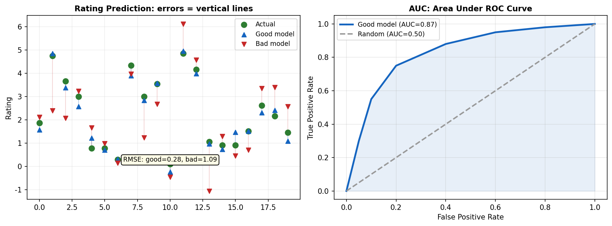

# 4장. Rating 메트릭

---

## 4.1 Rating 예측 평가



*[그림 4-1] 왼쪽: Rating 예측 오차 시각화 / 오른쪽: AUC — ROC 커브 아래 면적*

| Metric | 수식 | 용도 |
|--------|------|------|
| **RMSE** | `sqrt(mean((actual - pred)^2))` | 평점 예측 정확도 (큰 오차 페널티) |
| **MAE** | `mean(abs(actual - pred))` | 평점 예측 정확도 (균등 페널티) |
| **R²** | `1 - SS_res / SS_tot` | 설명력 (1에 가까울수록 좋음) |
| **AUC** | Area Under ROC Curve | 이진 분류 (클릭/비클릭) 성능 |
| **LogLoss** | `-mean(y*log(p) + (1-y)*log(1-p))` | CTR 예측 정확도 |

```python
from recommenders.evaluation.python_evaluation import (
    rmse, mae, rsquared, exp_var, auc, logloss
)
eval_rmse = rmse(test_df, pred_df, col_prediction='prediction')
eval_auc = auc(test_df, pred_df, col_prediction='prediction')
```

> **HSTU 스터디 연결**: HSTU의 MultitaskModule에서 Regression task = MSE (=RMSE²). 이 라이브러리의 RMSE 구현을 직접 가져와 평가에 사용 가능.

---

[← 3장](../part1/ch03_quick_benchmark.md) | [목차](../README.md) | [5장 →](ch05_ranking_metrics.md)
