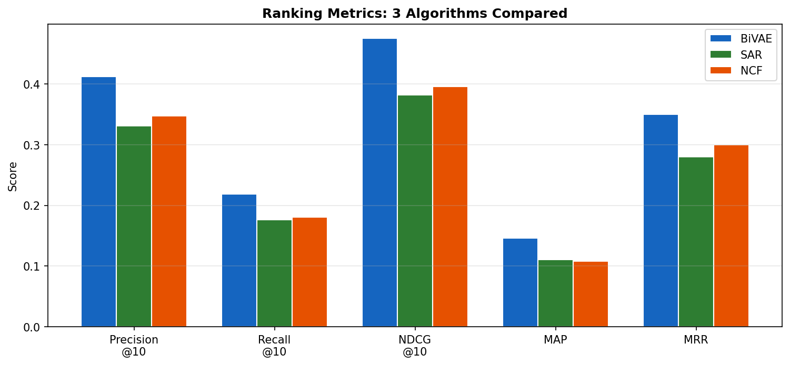

# 5장. Ranking 메트릭

---

## 5.1 Top-K 메트릭 비교



*[그림 5-1] BiVAE, SAR, NCF의 5가지 Ranking 메트릭 비교*

| Metric | 의미 | 수식 핵심 | K 의존 |
|--------|------|----------|--------|
| **Precision@K** | 추천 K개 중 정답 비율 | `relevant ∩ recommended / K` | O |
| **Recall@K** | 전체 정답 중 추천된 비율 | `relevant ∩ recommended / total_relevant` | O |
| **NDCG@K** | 순위 가중 정답 품질 | `DCG / IDCG` (높은 순위일수록 가치↑) | O |
| **MAP** | 평균 정밀도의 평균 | `mean(AP per user)` | X |
| **MRR** | 첫 정답의 역순위 | `mean(1/rank_of_first_hit)` | X |

```python
from recommenders.evaluation.python_evaluation import (
    precision_at_k, recall_at_k, ndcg_at_k, map_at_k
)
# K=10으로 평가
results = {
    "Precision@10": precision_at_k(test, top_k, k=10),
    "Recall@10": recall_at_k(test, top_k, k=10),
    "NDCG@10": ndcg_at_k(test, top_k, k=10),
    "MAP": map_at_k(test, top_k, k=10),
}
```

> **HSTU 스터디 연결**: HSTU 벤치마크의 HR@10 = 이 라이브러리의 Recall@10과 유사 (정답이 1개일 때 동일). NDCG@10은 양쪽 모두 동일한 정의.

---

[← 4장](ch04_rating_metrics.md) | [목차](../README.md) | [6장 →](ch06_beyond_accuracy.md)
