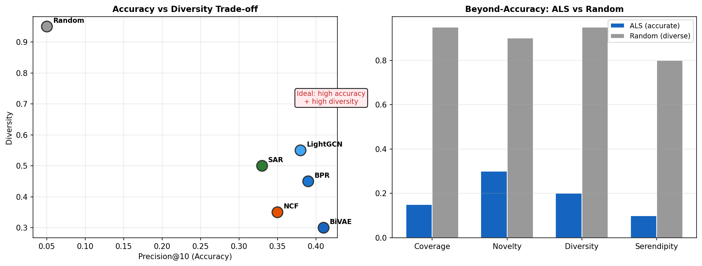

# 6장. Beyond-Accuracy 메트릭

> 정확도만으로는 부족하다 — Diversity, Novelty, Serendipity, Coverage

---

## 6.1 Accuracy vs Diversity Trade-off



*[그림 6-1] 왼쪽: 정확도↑ ≠ 다양성↑ (트레이드오프) / 오른쪽: ALS vs Random의 beyond-accuracy 비교*

## 6.2 메트릭 정의

| Metric | 의미 | 수식 핵심 |
|--------|------|----------|
| **Catalog Coverage** | 전체 아이템 중 추천된 비율 | `unique_recommended / total_items` |
| **Diversity** | 추천 리스트 내 아이템 간 비유사도 | `1 - avg(similarity(i, j))` |
| **Novelty** | 얼마나 비인기 아이템을 추천하는가 | `-avg(log2(popularity))` |
| **Serendipity** | 예상 밖이면서 관련성 있는 추천 | `unexpected ∩ relevant / K` |

```python
from recommenders.evaluation.python_evaluation import (
    catalog_coverage, diversity, novelty, serendipity
)
cov = catalog_coverage(train, top_k, col_item='itemID')
div = diversity(train, top_k, col_item='itemID')
nov = novelty(train, top_k, col_item='itemID')
ser = serendipity(train, top_k, col_item='itemID')
```

## 6.3 ABT Framework에서의 활용

| Business Goal | Proxy Metric (Accuracy) | Guard Metric (Beyond) |
|---------------|------------------------|----------------------|
| 클릭률 향상 | Precision@10, NDCG@10 | Diversity (filter bubble 방지) |
| 탐색 촉진 | Recall@10 | Novelty, Serendipity |
| 롱테일 노출 | — | Catalog Coverage |
| 체류시간 | MAP | Diversity + Novelty |

> **핵심 인사이트**: 정확도 메트릭만 최적화하면 인기 아이템만 추천 (filter bubble). Beyond-accuracy 메트릭을 guard rail로 사용하여 다양성을 보장해야 함.

---

[← 5장](ch05_ranking_metrics.md) | [목차](../README.md) | [7장 →](../part3/ch07_sar.md)
