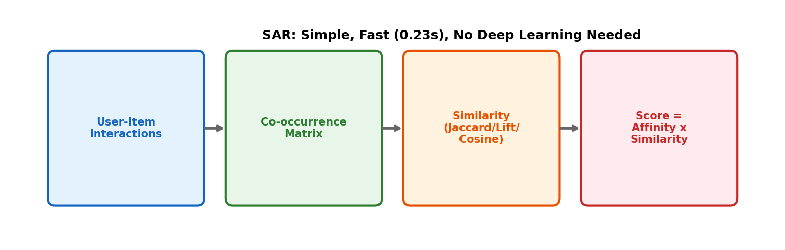

# 7장. SAR (Simple Algorithm for Recommendation)

> 가장 빠른 베이스라인 — 0.23초 학습, 딥러닝 불필요

---

## 7.1 알고리즘 흐름



*[그림 7-1] SAR: 공동발생 → 유사도 → 점수 계산. GPU 불필요, 0.23초에 Precision 0.33.*

### 핵심 수식

```
1. Co-occurrence: C[i,j] = count(users who interacted with both i and j)
2. Similarity: S[i,j] = Jaccard(i,j) = C[i,j] / (C[i,i] + C[j,j] - C[i,j])
3. Affinity: A[u,i] = sum(interactions) * time_decay(t)
4. Score: score[u,j] = A[u,:] @ S[:,j]   (affinity × similarity)
```

```python
from recommenders.models.sar import SARSingleNode

model = SARSingleNode(
    similarity_type="jaccard",      # or "lift", "cosine", "cooccurrence"
    time_decay_coefficient=30,      # exponential time decay (days)
    timedecay_formula=True,
)
model.fit(train_df)
top_k = model.recommend_k_items(test_df, top_k=10, remove_seen=True)
```

> **실무 적용**: SAR를 장소추천 베이스라인으로 사용 가능. 장소 방문 공동발생 + Jaccard 유사도 → 빠르고 해석 가능한 추천. HSTU 적용 전 비교 기준.

---

[← 6장](../part2/ch06_beyond_accuracy.md) | [목차](../README.md) | [8장 →](ch08_als_mf.md)
