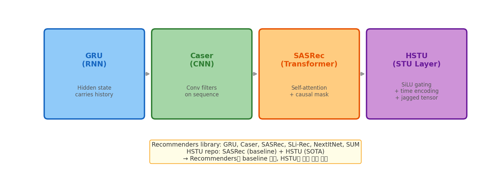

# 10장. Sequential Models

> HSTU 스터디와 직접 연결되는 핵심 장

---

## 10.1 Sequential 모델 진화



*[그림 10-1] GRU → Caser → SASRec → HSTU. Recommenders 라이브러리에 GRU~SASRec 구현. HSTU는 별도 레포.*

## 10.2 Recommenders의 SASRec

```python
# recommenders/models/sasrec/model.py (PyTorch)
class SASREC(nn.Module):           # Note: all caps class name
    def __init__(self, **kwargs):  # kwargs pattern, not positional args
        super(SASREC, self).__init__()
        self.item_num = kwargs.get("item_num", None)
        self.seq_max_len = kwargs.get("seq_max_len", 100)
        self.num_blocks = kwargs.get("num_blocks", 2)
        self.embedding_dim = kwargs.get("embedding_dim", 100)
        self.attention_num_heads = kwargs.get("attention_num_heads", 1)
        self.dropout_rate = kwargs.get("dropout_rate", 0.5)

        self.item_embedding_layer = nn.Embedding(       # NOT item_emb
            self.item_num + 1, self.embedding_dim, padding_idx=0)
        self.positional_embedding_layer = nn.Embedding(  # NOT pos_emb
            self.seq_max_len, self.embedding_dim)
        self.encoder = Encoder(self.num_blocks, ...)     # Transformer blocks
```

### SASRec: 이 라이브러리 vs HSTU 레포

| 측면 | Recommenders `SASREC` | HSTU Repo `SASRec` |
|------|-------------------|------------------|
| Class name | `SASREC` (all caps) | `SASRec` (CamelCase) |
| Init style | `**kwargs` dict | Explicit params + gin |
| Framework | PyTorch | PyTorch (gin-config) |
| Attention | Standard softmax | Standard softmax |
| Position | Learned absolute | Learned absolute |
| Loss | BCE | Sampled Softmax |
| Data | Amazon (notebook) | MovieLens, Amazon |
| 목적 | 독립 모델 | HSTU의 baseline |

## 10.3 기타 Sequential 모델

| Model | Mechanism | Key Feature |
|-------|-----------|-------------|
| **GRU** | Recurrent | Hidden state = 이전 행동의 요약 |
| **Caser** | CNN | 수평/수직 convolution 필터 |
| **NextItNet** | Dilated CNN | 넓은 receptive field |
| **SLi-Rec** | Attention + RNN | Short/Long-term 분리 (HSTU와 유사 목적!) |
| **SUM** | Multi-Interest | 여러 관심사를 동시에 모델링 |

> **핵심**: SLi-Rec의 "Short/Long-term 분리" 개념은 HSTU가 해결하려는 동일한 문제. SLi-Rec은 RNN+Attention으로 접근, HSTU는 STU Layer로 접근.

---

[← 9장](ch09_ncf_deep.md) | [목차](../README.md) | [11장 →](ch11_news_content.md)
