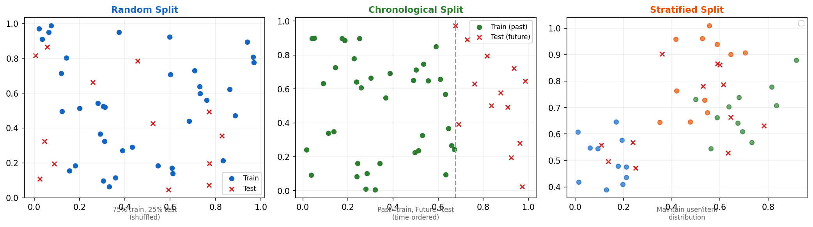

# 13장. 데이터 분할 전략

---

## 13.1 3가지 분할 전략



*[그림 13-1] Random (무작위) / Chronological (시간순) / Stratified (분포 유지)*

| Strategy | 함수 | 용도 | 주의 |
|----------|------|------|------|
| **Random** | `python_random_split` | 일반 평가 | 시간 순서 무시 |
| **Chronological** | `python_chrono_split` | 시퀀셜 모델 | **추천 시뮬레이터에 필수** |
| **Stratified** | `python_stratified_split` | 유저/아이템 분포 유지 | Cold-start 방지 |

```python
from recommenders.datasets.python_splitters import (
    python_random_split,
    python_chrono_split,
    python_stratified_split,
)

# 추천 시뮬레이터용: 시간순 분할 (과거=학습, 미래=평가)
train, test = python_chrono_split(data, ratio=0.75, col_timestamp="timestamp")

# 일반 벤치마크: 층화 분할 (유저별 비율 유지)
train, test = python_stratified_split(data, ratio=0.75)
```

> **HSTU 스터디 연결**: HSTU는 시퀀스의 마지막 아이템을 target으로 사용 (`ignore_last_n=1`). 이것은 chronological split의 특수 케이스. 이 라이브러리의 `python_chrono_split`이 더 유연한 시간 기반 분할을 제공.

---

[← 12장](ch12_datasets.md) | [목차](../README.md) | [14장 →](ch14_experiment_pipeline.md)
