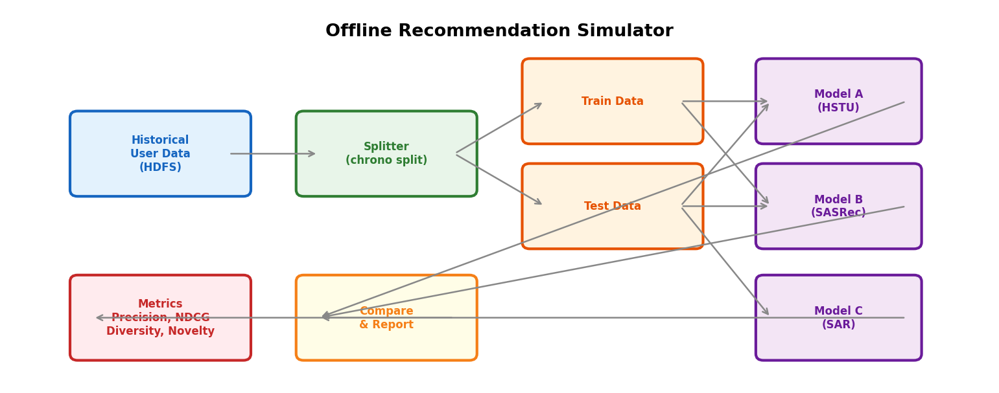

# 15장. 추천 시뮬레이터 설계

> 이 라이브러리의 핵심 가치: offline evaluation 방법론을 직접 차용

---

## 15.1 시뮬레이터 아키텍처



*[그림 15-1] Offline 추천 시뮬레이터: 데이터 → 분할 → 여러 모델 학습 → 동일 메트릭으로 비교*

## 15.2 차용할 구성 요소

| Component | From Library | 파일 |
|-----------|-------------|------|
| **메트릭 계산** | `evaluation/python_evaluation.py` | 20+ 메트릭 구현체 |
| **데이터 분할** | `datasets/python_splitters.py` | Chrono/Stratified split |
| **베이스라인 모델** | `models/sar/`, `models/sasrec/` | SAR, SASRec 구현체 |
| **벤치마크 프레임워크** | `examples/06_benchmarks/` | 비교 파이프라인 |

## 15.3 시뮬레이터 구현 스케치

```python
# simulator.py (concept)
from recommenders.datasets import movielens
from recommenders.datasets.python_splitters import python_chrono_split
from recommenders.evaluation.python_evaluation import *

class RecommenderSimulator:
    def __init__(self, data, split_ratio=0.75):
        self.train, self.test = python_chrono_split(data, ratio=split_ratio)
        self.models = {}
        self.results = {}

    def add_model(self, name, model):
        self.models[name] = model

    def run(self, k=10):
        for name, model in self.models.items():
            model.fit(self.train)
            top_k = model.recommend_k_items(self.test, top_k=k)
            self.results[name] = {
                "Precision@K": precision_at_k(self.test, top_k, k=k),
                "NDCG@K": ndcg_at_k(self.test, top_k, k=k),
                "MAP": map_at_k(self.test, top_k, k=k),
                "Diversity": diversity(self.train, top_k),
                "Novelty": novelty(self.train, top_k),
                "Coverage": catalog_coverage(self.train, top_k),
            }

    def report(self):
        return pd.DataFrame(self.results).T
```

---

[← 14장](../part4/ch14_experiment_pipeline.md) | [목차](../README.md) | [16장 →](ch16_abt_framework.md)
