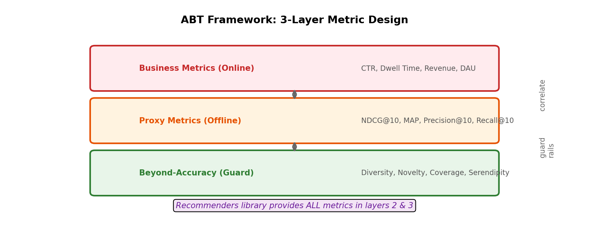

# 16장. ABT Framework 설계

---

## 16.1 3-Layer Metric Design



*[그림 16-1] Business → Proxy → Guard: 3계층 메트릭 설계. Recommenders 라이브러리가 Layer 2, 3의 모든 메트릭을 제공.*

## 16.2 메트릭 매핑

| Layer | Metric | Library Function | 실무 적용 |
|-------|--------|-----------------|------------|
| **Business** | CTR | (online only) | 장소추천 클릭률 |
| **Business** | Dwell Time | (online only) | 콘텐츠피드 체류시간 |
| **Proxy** | NDCG@10 | `ndcg_at_k()` | **Primary offline metric** |
| **Proxy** | Precision@10 | `precision_at_k()` | 정확도 |
| **Proxy** | MAP | `map_at_k()` | 순위 품질 |
| **Guard** | Diversity | `diversity()` | Filter bubble 방지 |
| **Guard** | Novelty | `novelty()` | 롱테일 노출 |
| **Guard** | Coverage | `catalog_coverage()` | 카탈로그 활용도 |

## 16.3 A/B 테스트 연동

```
Offline (Simulator):
  → NDCG@10: Model A = 0.45, Model B = 0.42
  → Diversity: Model A = 0.3, Model B = 0.6
  → Decision: Model B (diversity가 2배, 정확도 차이 적음)

Online (A/B Test):
  → Control: Current model
  → Treatment: Model B
  → Measure: CTR, Dwell Time, DAU
  → Guard rail: Diversity >= 0.5 (offline에서 검증)
```

## 16.4 전체 스터디 요약: HSTU + Recommenders

```
┌─────────────────────────────────────────────────┐
│  HSTU Study (1st Priority)                      │
│  → Model Architecture (next-gen ranker)         │
│  → Target-Aware Attention, SiLU Gating          │
│  → GPU optimization (Triton, Jagged Tensor)     │
└──────────────┬──────────────────────────────────┘
               │ feeds into
┌──────────────▼──────────────────────────────────┐
│  Recommenders Study (2nd Priority)              │
│  → Evaluation Framework (simulator)             │
│  → Baseline Algorithms (SAR, SASRec, etc.)      │
│  → ABT Framework (proxy metrics + guard rails)  │
└──────────────┬──────────────────────────────────┘
               │ enables
┌──────────────▼──────────────────────────────────┐
│  2026 Deliverables                               │
│  → Train HSTU-based ranker                      │
│  → Evaluate with Recommenders metrics           │
│  → A/B test with ABT framework                  │
│  → Deploy on N3R Kubernetes                     │
└─────────────────────────────────────────────────┘
```

---

[← 15장](ch15_simulator_design.md) | [목차](../README.md)
