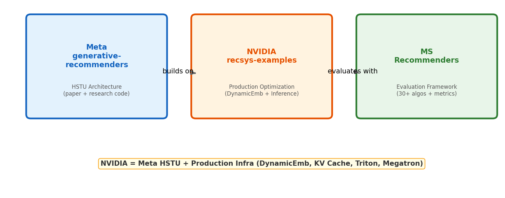

# 1장. 프로젝트 개요

---

## 1.1 3개 레포의 관계



*[그림 1-1] Meta = HSTU 논문 구현 → NVIDIA = 프로덕션 확장 → MS Recommenders = 평가 프레임워크*

> **NVIDIA recsys-examples = Meta HSTU + Production Infrastructure**
> - Meta의 HSTU 아키텍처를 그대로 가져오되
> - **DynamicEmb**: GPU 해시테이블 기반 동적 임베딩 (수십억 아이템 대응)
> - **Async KV Cache**: 비동기 H2D 전송으로 추론 latency 숨기기
> - **Megatron-Core**: Tensor Parallel + Data Parallel 분산 학습
> - **Triton/AOTInductor**: 프로덕션 서빙 (C++ export)

## 1.2 레포 구조

```
recsys-examples/
├── corelib/
│   ├── dynamicemb/        # GPU 동적 임베딩 (C++ CUDA + Python)
│   │   ├── src/           # CUDA 커널 (lookup, insert, evict, optimizer)
│   │   └── dynamicemb/    # Python API (config, planner, tables)
│   └── hstu/              # HSTU 어텐션 커널 (deprecated → fbgemm_gpu)
├── examples/
│   ├── hstu/              # HSTU Ranking/Retrieval 모델
│   │   ├── model/         # RankingGR, RetrievalGR, InferenceRankingGR
│   │   ├── modules/       # HSTU layers, processors, KV cache
│   │   ├── training/      # 학습 스크립트 + gin configs
│   │   └── inference/     # 추론 + Triton integration
│   └── sid_gr/            # Semantic ID 기반 생성형 검색 (beam search)
├── docker/                # Dockerfile (CUDA 13.0, FBGEMM, TorchRec, Megatron)
└── third_party/           # FBGEMM submodule (HSTU 커널 최신 위치)
```

## 1.3 핵심 의존성

| Library | Version | Role |
|---------|---------|------|
| **TorchRec** | v1.2.0+ | 분산 임베딩 (sharding, all-to-all) |
| **Megatron-Core** | v0.12.1 | Dense 모델 병렬화 (TP/DP/SP/PP) |
| **FBGEMM** | main | HSTU 어텐션 커널 (Ampere/Hopper/Blackwell) |
| **gin-config** | - | 하이퍼파라미터 설정 |

---

[목차](../README.md) | [2장 →](ch02_meta_vs_nvidia.md)
