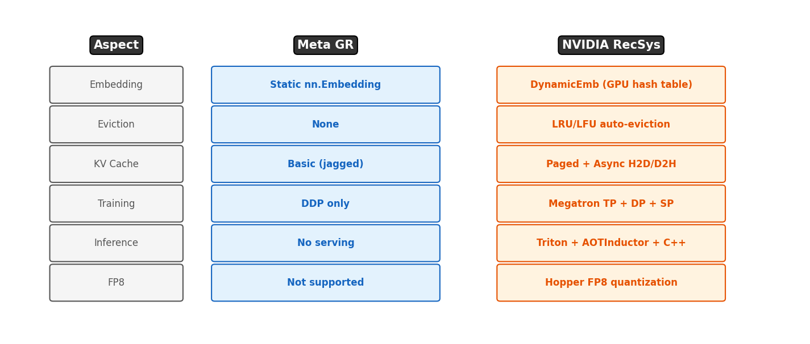

# 2장. Meta GR vs NVIDIA RecSys

---

## 2.1 7가지 핵심 차이

*[그림 2-1] Meta는 연구용, NVIDIA는 프로덕션용. 핵심 차이는 임베딩, KV Cache, 분산 학습, 서빙.*

### 상세 비교

| Aspect | Meta GR | NVIDIA RecSys | 왜 중요? |
|--------|---------|--------------|---------|
| **Embedding** | `nn.Embedding` (static) | **DynamicEmb** (GPU hash table) | 수십억 아이템 동적 관리 |
| **Eviction** | 없음 | LRU/LFU 자동 퇴출 | 메모리 효율적 관리 |
| **KV Cache** | 기본 (jagged) | **Paged + Async H2D/D2H** | 추론 latency 3-8x 감소 |
| **Training** | DDP only | **Megatron TP + DP + SP** | 1000+ GPU 확장 |
| **Inference** | 없음 | **Triton + AOTInductor C++** | 프로덕션 서빙 |
| **FP8** | 미지원 | Hopper FP8 양자화 | 메모리/속도 2x 향상 |
| **SID-GR** | 없음 | Semantic ID + Beam Search | 생성형 검색 (retrieval) |

> **HSTU 스터디 연결**: Meta의 `modules/stu.py`가 기본 STU Layer라면, NVIDIA의 `native_hstu_layer.py`는 TP/SP/CUDA Graph이 추가된 프로덕션 버전.

---

[← 1장](ch01_overview.md) | [목차](../README.md) | [3장 →](../part2/ch03_dynamicemb_arch.md)
