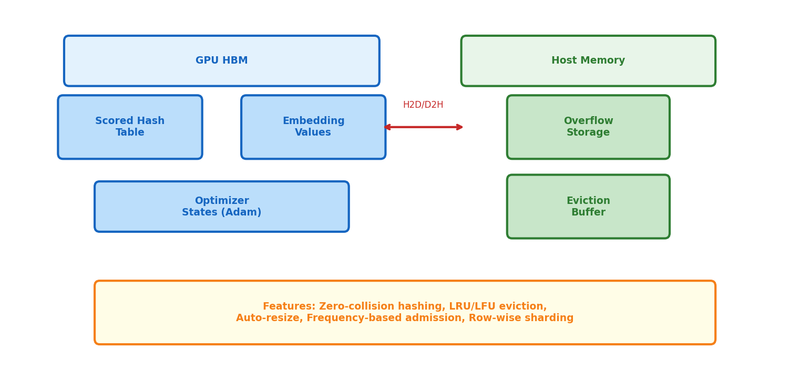

# 3장. DynamicEmb 아키텍처

> GPU 해시테이블 기반 동적 임베딩 -- 수십억 아이템을 효율적으로 관리

---

## 3.1 아키텍처 개요



*[그림 3-1] GPU HBM에 해시테이블 + 값 저장, Host에 overflow. 양방향 H2D/D2H 전송.*

## 3.2 vs Static Embedding

| 측면 | `nn.Embedding` (Meta) | DynamicEmb (NVIDIA) |
|------|---------------------|-------------------|
| **크기** | 고정 (num_items × D) | 동적 (자동 확장/축소) |
| **새 아이템** | 재학습 필요 | 실시간 추가 |
| **메모리** | 전체 로드 | LRU/LFU로 hot items만 |
| **충돌** | Hash trick (충돌 허용) | **Zero-collision** (scored eviction) |
| **Backend** | PyTorch Tensor | **C++ CUDA Hash Table** |

## 3.3 Scored Hash Table

```
Lookup Pipeline:
1. hash(key) → bucket_id
2. Linear probe in bucket (bucket_capacity=128)
3. Found? → return embedding + update score (LRU timestamp)
4. Not found? → return zero vector (or insert new)

Insert Pipeline:
1. hash(key) → bucket_id
2. Probe for empty slot
3. Bucket full? → evict lowest-score entry
4. Insert key + embedding + score
```

```python
# corelib/dynamicemb/dynamicemb/dynamicemb_config.py
DynamicEmbTableOptions(
    embedding_dtype=torch.bfloat16,
    dim=128,                       # embedding dimension
    max_capacity=10_000_000,       # max rows per GPU shard
    bucket_capacity=128,           # hash bucket width
    evict_strategy=DynamicEmbEvictStrategy.KLru,  # LRU eviction
    max_load_factor=0.5,           # rehash threshold
)
```

> **DE 관점**: Redis의 LRU eviction + hash table을 GPU HBM에서 CUDA 커널로 구현한 것. `bucket_capacity=128`은 Redis의 `maxmemory-samples`와 유사한 역할.

---

[← 2장](../part1/ch02_meta_vs_nvidia.md) | [목차](../README.md) | [4장 →](ch04_dynamicemb_ops.md)
