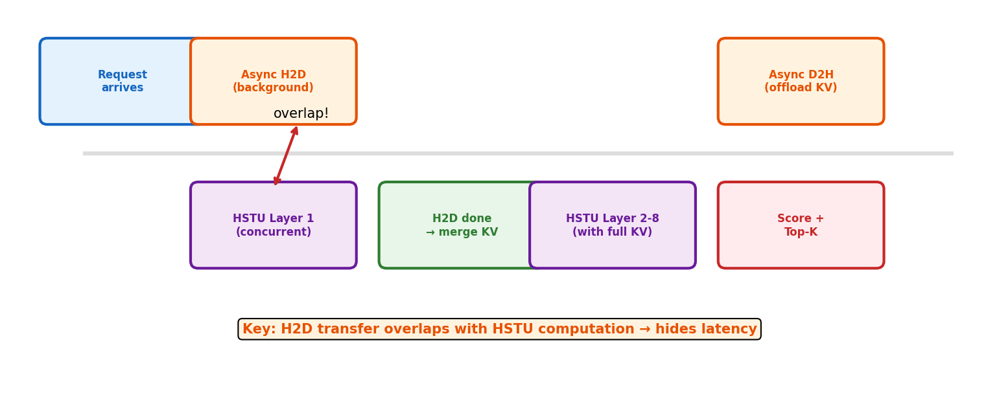

# 5장. Async KV Cache

> 추론 latency의 핵심 -- H2D 전송과 HSTU 연산을 겹쳐서 지연 숨기기

---

## 5.1 비동기 파이프라인



*[그림 5-1] H2D 전송과 HSTU 연산이 동시에 실행. 전송 시간이 "숨겨짐".*

## 5.2 Paged KV Cache 구조

```python
# KV Cache 테이블 shape:
# [num_layers, num_cache_pages, 2, page_size, num_heads, head_dim]
#                               ^ K and V

# Page-based allocation:
# pages_per_seq = ceil(max_seq_len / page_size)
# LRU eviction when pages exhausted
```

## 5.3 3단계 파이프라인

```
1. prepare_kvcache_async()
   → 별도 CUDA stream에서 Host → GPU 전송 시작
   → 동시에 CPU에서 메타데이터 계산

2. prepare_kvcache_wait()
   → H2D 완료 대기 + 페이지 할당 확정

3. HSTU forward + append_kvcache()
   → HSTU 연산 수행
   → 새로 생성된 KV를 캐시에 추가

4. offload_kvcache() (background)
   → 완료된 KV를 GPU → Host로 비동기 전송
```

> **HSTU 스터디 연결**: Meta의 `STULayer.cached_forward()`는 KV Cache의 기본 개념. NVIDIA는 이를 **Paged + Async**로 확장하여 실제 서빙에서의 latency를 3-8x 줄임.

---

[← 4장](../part2/ch04_dynamicemb_ops.md) | [목차](../README.md) | [6장 →](ch06_inference_serving.md)
