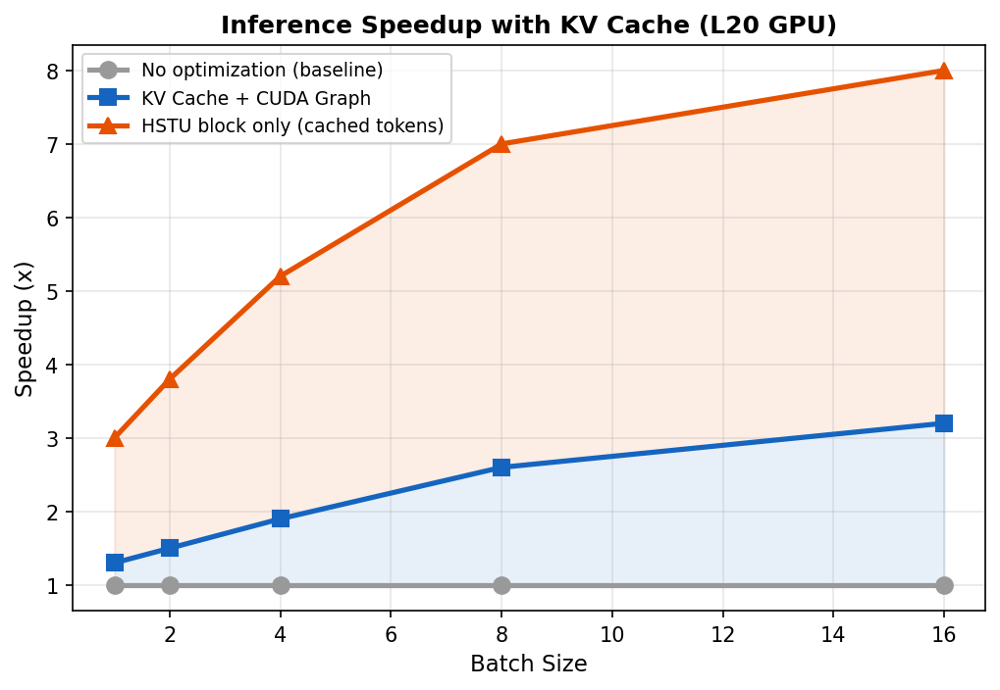

# 6장. 추론 서빙 최적화

---

## 6.1 Inference Speedup



*[그림 6-1] KV Cache + CUDA Graph으로 최대 8x 속도 향상 (L20 GPU 기준)*

## 6.2 최적화 기법 3가지

### A. CUDA Graph
```python
# 커널 실행 순서를 한 번 기록 → 반복 재생
# 커널 launch overhead 제거 (특히 small batch에서 효과적)
# 제약: 입력 shape이 동일해야 함 → padding 필요
```

### B. Kernel Fusion
```python
# 여러 연산을 하나의 CUDA 커널로 합침
# 예: LayerNorm + Dropout → triton_layer_norm_dropout
#     AddMM + SiLU → triton_addmm_silu_fwd
# 효과: GPU 메모리 접근 횟수 감소 → bandwidth 병목 해소
```

### C. Triton Server + AOTInductor
```
# 1. 모델 export
torch.export(model) → torch._inductor.aoti_compile_and_package → model.pt2

# 2. Triton Server 배포
Sparse backend (Python): 임베딩 룩업 (GPU당 공유)
Dense backend (C++): HSTU + MLP (GPU당 1개 인스턴스)

# 3. Request flow
Client → Triton → Sparse lookup → Dense inference → Response
```

## 6.3 성능 수치

| Config | Without KV | With KV+CUDA | Speedup |
|--------|-----------|-------------|---------|
| Batch 1, 8 layers | baseline | 1.3x | 30% faster |
| Batch 8, 8 layers | baseline | 2.6x | 160% faster |
| HSTU block only, batch 8 | baseline | **8.0x** | 700% faster |

---

[← 5장](ch05_async_kvcache.md) | [목차](../README.md) | [7장 →](../part4/ch07_distributed.md)
