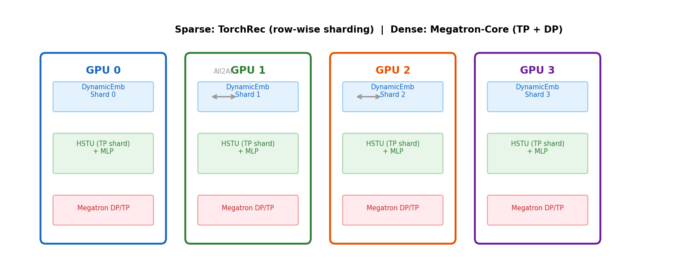

# 7장. 분산 학습 아키텍처

---

## 7.1 Sparse + Dense 분리



*[그림 7-1] Sparse(임베딩): TorchRec row-wise sharding / Dense(HSTU+MLP): Megatron TP+DP*

## 7.2 병렬화 전략

| Component | Library | Parallelism | Communication |
|-----------|---------|------------|---------------|
| DynamicEmb | TorchRec | Row-wise sharding | All-to-All |
| HSTU Linear | Megatron | **Tensor Parallel** | AllReduce |
| HSTU Attention | Megatron | **Sequence Parallel** | AllGather |
| MLP | Megatron | **Data Parallel** | AllReduce |

## 7.3 Gradient 동기화

```
1. DynamicEmb gradients → scale by TP_size × DP_size
2. AllGather across TP group
3. DDP AllReduce across DP group
4. Optimizer step (per-shard)
```

> **HSTU 스터디 연결**: Meta의 `DDP(model, device_ids=[rank])`는 Data Parallel만 지원. NVIDIA는 **Tensor Parallel**을 추가하여 단일 모델을 여러 GPU에 분할. 이는 모델이 단일 GPU 메모리에 안 들어갈 때 필수.

---

[← 6장](../part3/ch06_inference_serving.md) | [목차](../README.md) | [8장 →](ch08_training_pipeline.md)
