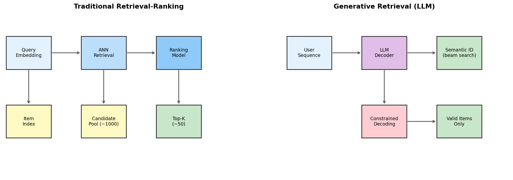
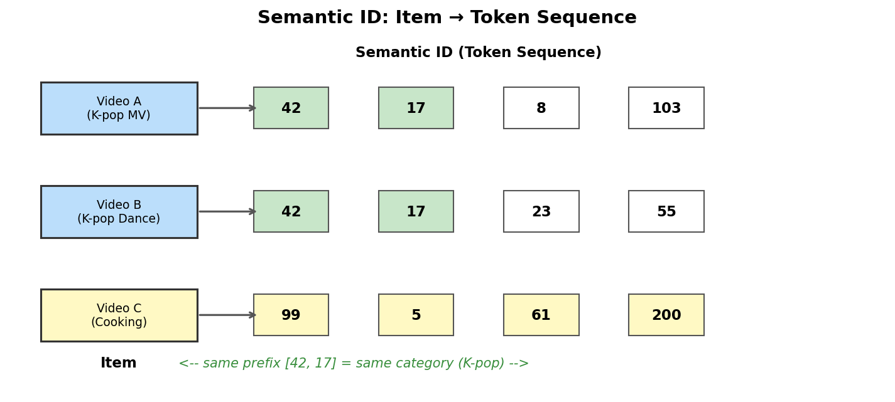
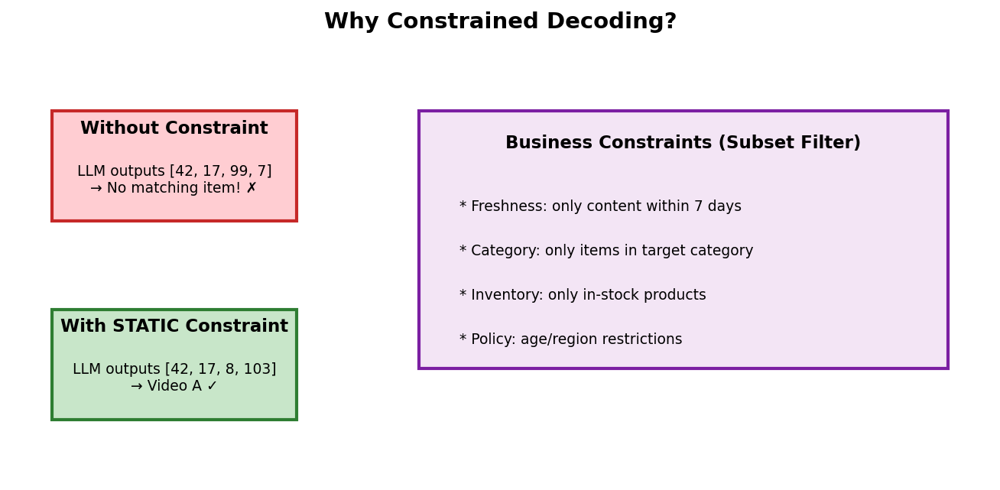

# 1장. Generative Retrieval & Semantic ID

---

## 1.1 기존 추천 vs 생성형 추천



*[그림 1-1] 기존 Retrieval-Ranking 파이프라인 vs LLM 기반 Generative Retrieval*

| 구분 | Traditional Retrieval-Ranking | Generative Retrieval |
|------|------------------------------|---------------------|
| **아키텍처** | Query Embedding → ANN → Ranker | User Sequence → LLM → Semantic ID |
| **후보 생성** | 별도 인덱스에서 ANN 검색 (~1000개) | LLM이 직접 아이템 ID를 토큰 단위로 생성 |
| **모델 역할** | Retrieval과 Ranking 분리 | 단일 모델이 생성으로 검색 수행 |
| **확장성** | 인덱스 크기에 비례 | 제약 집합 크기에 독립적 (STATIC) |
| **유연성** | 인덱스 재구축 필요 | 제약 조건만 교체하면 비즈니스 로직 반영 |

> **핵심**: Generative Retrieval은 추천을 "검색 문제"가 아닌 "생성 문제"로 재정의합니다.
> LLM이 유저 행동 시퀀스를 입력받아 추천 아이템의 Semantic ID를 autoregressive하게 생성합니다.

---

## 1.2 Semantic ID란?



*[그림 1-2] 아이템을 고정 길이 토큰 시퀀스(Semantic ID)로 인코딩*

| 속성 | 설명 |
|------|------|
| **구조** | 각 아이템 = 고정 길이 L의 토큰 시퀀스 (e.g., L=8) |
| **어휘** | 토큰은 vocab_size V 범위 내 정수 (e.g., V=2048) |
| **계층성** | prefix가 같으면 의미적으로 유사 (같은 카테고리) |
| **생성 방식** | RQ-VAE, product quantization 등으로 아이템 임베딩을 이산화 |
| **총 아이템 수** | N개의 유효한 Semantic ID (e.g., N=수백만) |

```
아이템 "K-pop MV" → Semantic ID: [42, 17, 8, 103, 55, 200, 33, 91]
아이템 "K-pop Dance" → Semantic ID: [42, 17, 23, 55, 12, 88, 67, 44]
                         ↑ prefix 공유 = 같은 카테고리
```

---

## 1.3 Constrained Decoding이 필요한 이유



*[그림 1-3] LLM이 유효하지 않은 아이템을 생성할 수 있는 문제*

LLM의 autoregressive decoding은 매 스텝마다 V개 토큰 중 하나를 선택합니다.
L 스텝이면 가능한 조합은 V^L개이지만, 유효한 Semantic ID는 N개뿐입니다.

| 파라미터 | 예시 값 | 설명 |
|---------|---------|------|
| V (vocab size) | 2,048 | 한 스텝의 선택지 |
| L (sequence length) | 8 | 토큰 수 |
| V^L (전체 조합) | 2,048⁸ ≈ 10²⁶ | 이론적 출력 공간 |
| N (유효 아이템) | ~10M | 실제 존재하는 아이템 |
| **유효 비율** | **10⁻¹⁹** | 제약 없이 유효한 ID를 생성할 확률 |

> **Constrained Decoding = 매 스텝에서 유효한 다음 토큰만 선택하도록 마스킹**

추가로, 비즈니스 로직에 따라 전체 N개 중 **부분 집합만 허용**할 수 있습니다:
- 최근 7일 이내 콘텐츠만 (freshness)
- 특정 카테고리만 (category filter)
- 재고 있는 상품만 (inventory)
- 지역/연령 제한 (policy)

---

[목차](../README.md) | [2장 →](ch02_trie_and_csr.md)
