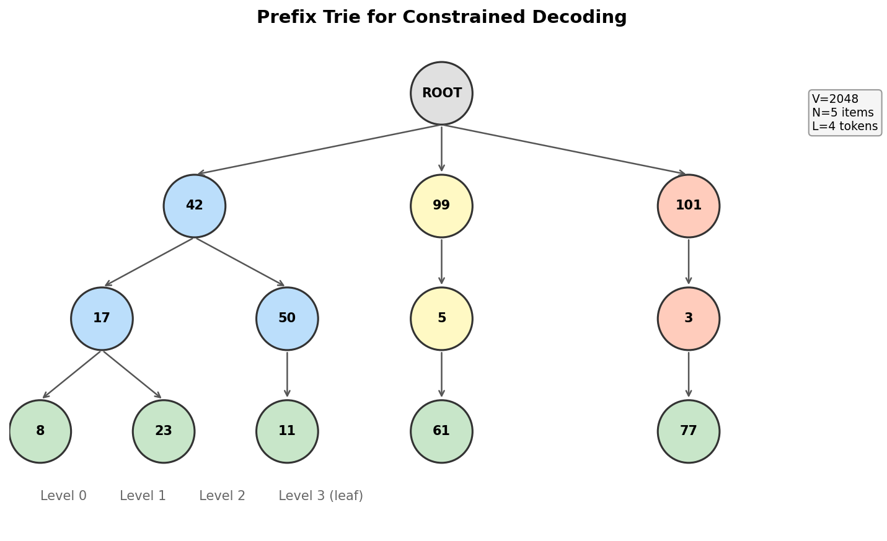
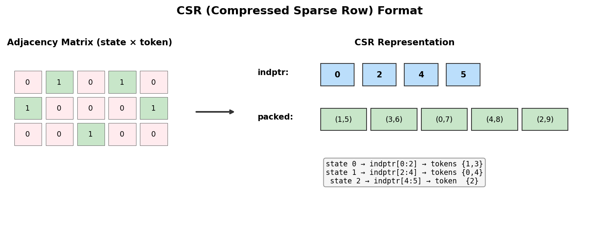
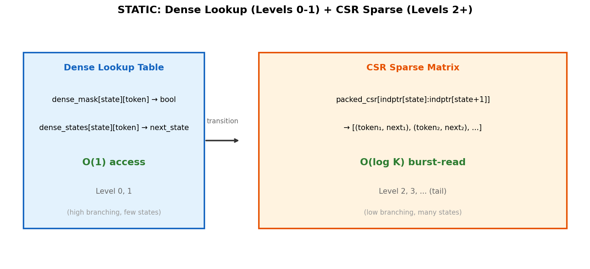

# 2장. Trie 구조와 CSR 포맷

---

## 2.1 Prefix Trie



*[그림 2-1] Semantic ID 집합을 Prefix Trie로 표현*

Constrained decoding의 기본 자료구조는 **Prefix Trie (접두사 트리)**입니다.

| 개념 | 설명 |
|------|------|
| **노드** | 특정 prefix까지의 상태 |
| **엣지** | 다음 토큰 (부모 → 자식 전이) |
| **루트** | 아무 토큰도 선택하지 않은 초기 상태 |
| **리프** | 완전한 Semantic ID (L 토큰 모두 선택됨) |
| **유효 전이** | 현재 노드에서 나가는 엣지의 토큰들만 "valid" |

```
매 디코딩 스텝에서:
  1. 현재 상태(노드) 확인
  2. 해당 노드의 자식 엣지 토큰만 허용
  3. 나머지는 logprob = -∞ 로 마스킹
```

### 기존 Trie의 문제점

| 문제 | 설명 |
|------|------|
| **CPU 기반** | 포인터 체이싱 → GPU/TPU에서 비효율적 |
| **동기화** | 매 스텝마다 CPU↔가속기 round-trip 발생 |
| **비벡터화** | 배치/빔 병렬 처리 불가 |
| **메모리** | 딕셔너리 기반으로 캐시 비효율적 |

---

## 2.2 CSR (Compressed Sparse Row) 포맷



*[그림 2-2] 희소 인접 행렬을 CSR로 압축*

**CSR**은 희소 행렬을 3개 배열로 표현하는 표준 포맷입니다.
STATIC은 Trie의 전이 관계를 CSR로 변환합니다.

| 배열 | 크기 | 역할 |
|------|------|------|
| `indptr` | (num_states + 1,) | 각 상태의 전이 범위 [start, end) |
| `packed_csr` | (num_transitions, 2) | (token_id, next_state) 쌍 |
| `layer_max_branches` | (L,) | 각 레벨의 최대 분기 수 |

```python
# 상태 s에서 가능한 전이 조회:
transitions = packed_csr[indptr[s] : indptr[s+1]]
# transitions[:, 0] = 유효 토큰 IDs
# transitions[:, 1] = 다음 상태 IDs
```

> **Data Engineer 관점**: CSR은 Spark의 sparse matrix, scipy.sparse.csr_matrix과 동일한 포맷입니다.
> 행 = 상태, 열 = 토큰, 값 = 다음 상태. "indptr로 슬라이싱"이 핵심 연산.

---

## 2.3 STATIC 하이브리드 설계



*[그림 2-3] Dense Lookup (초기 레벨) + CSR Sparse (후기 레벨)*

| 레벨 | 방식 | 이유 | 복잡도 |
|------|------|------|--------|
| 0 ~ d-1 (초기) | **Dense lookup table** | 분기 수 많음 (V에 가까움), 상태 수 적음 | **O(1)** |
| d ~ L-1 (후기) | **CSR sparse matrix** | 분기 수 적음, 상태 수 많음 → dense는 메모리 낭비 | **O(log K)** |

```python
# Dense (level < d_dense):
valid = dense_mask[current_state, :]          # O(1), shape (V,)
next_state = dense_states[current_state, :]   # O(1), shape (V,)

# Sparse (level >= d_dense):
row = packed_csr[indptr[state] : indptr[state+1]]  # burst-read
valid_tokens = row[:, 0]
next_states = row[:, 1]
```

### 왜 하이브리드인가?

| 레벨 | 상태 수 | 분기 수 (평균) | Dense 메모리 | CSR 메모리 |
|------|---------|--------------|-------------|-----------|
| 0 | 1 (root) | ~2,048 | 2,048 × 1 = **2KB** | 2,048 × 2 = 4KB |
| 1 | ~2,048 | ~500 | 2,048 × 2,048 = **4MB** | ~1M × 2 = 2MB |
| 2 | ~1,000,000 | ~10 | 1M × 2,048 = **2GB** ✗ | ~10M × 2 = 20MB ✓ |
| 3+ | ~10,000,000 | ~2 | **불가능** | ~20M × 2 = 40MB ✓ |

> `dense_lookup_layers=2`가 기본값인 이유: Level 2부터 Dense는 메모리 폭발

---

[← 1장](ch01_background.md) | [목차](../README.md) | [3장 →](../part2/ch03_offline_indexing.md)
