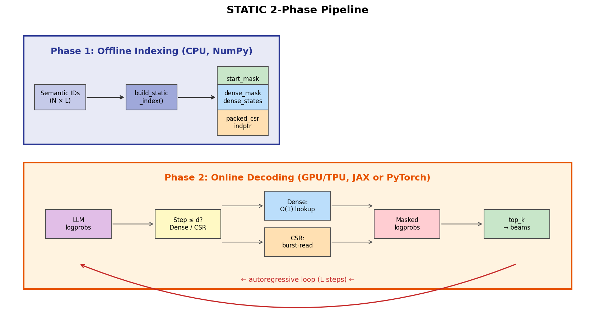
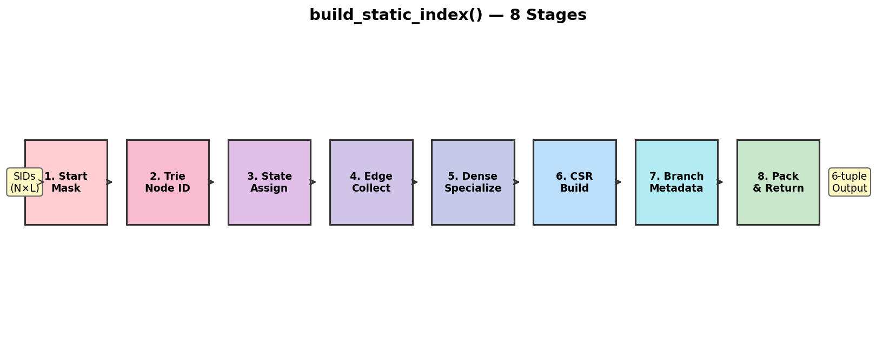

# 3장. Offline Indexing: build_static_index()

---

## 3.1 전체 파이프라인



*[그림 3-1] STATIC 2-Phase Pipeline: Offline (CPU) → Online (GPU/TPU)*

STATIC은 두 단계로 나뉩니다:

| Phase | 실행 환경 | 함수 | 시점 | 빈도 |
|-------|----------|------|------|------|
| **Offline Indexing** | CPU (NumPy) | `build_static_index()` | 아이템 카탈로그 변경 시 | 드문 배치 |
| **Online Decoding** | GPU/TPU (JAX/PyTorch) | `sparse_transition_*()` | 매 추천 요청 | 실시간 |

---

## 3.2 build_static_index() 8단계



*[그림 3-2] Semantic ID 배열 → 6-tuple 인덱스*

### 입력

```python
fresh_sids: np.ndarray  # shape (N, L), sorted, int
vocab_size: int = 2048
dense_lookup_layers: int = 2
```

### 8단계 상세

| 단계 | 이름 | 입력 | 출력 | 핵심 연산 |
|------|------|------|------|----------|
| 1 | Start Mask | sids[:, 0] | `start_mask` (V,) | 첫 토큰의 unique 값 → bool 마스크 |
| 2 | Trie Node ID | sids (sorted) | node boundaries | `sids[i, :d] != sids[i-1, :d]` 비교 |
| 3 | State Assign | boundaries | state IDs | unique prefix → integer ID 매핑 |
| 4 | Edge Collect | states, tokens | edge list | (parent_state, token, child_state) 수집 |
| 5 | Dense Specialize | edges (level < d) | `dense_mask`, `dense_states` | 다차원 lookup table 구성 |
| 6 | CSR Build | edges (level ≥ d) | `packed_csr`, `indptr` | bincount + cumsum → CSR |
| 7 | Branch Metadata | all edges | `layer_max_branches` | 레벨별 max fan-out 계산 |
| 8 | Pack & Return | 위 모든 것 | 6-tuple | 패딩 추가, 연속 메모리 배치 |

### 출력 6-tuple

```python
(
    packed_csr,          # (num_transitions + V, 2)  — [token, next_state] 쌍
    indptr,              # (num_states + 2,)         — CSR row pointer
    layer_max_branches,  # tuple of int              — 레벨별 최대 분기
    start_mask,          # (V,) bool                 — 유효한 첫 토큰
    dense_mask,          # (states, V) or higher-dim — 초기 레벨 유효성
    dense_states,        # (states, V) or higher-dim — 초기 레벨 다음 상태
)
```

---

## 3.3 Vectorized Trie 구축의 핵심 트릭

### 정렬 기반 노드 식별

```
sorted SIDs:
  [42, 17,  8, 103]   ← row 0
  [42, 17, 23,  55]   ← row 1 (level 2에서 달라짐 → 새 노드)
  [42, 50, 11,  77]   ← row 2 (level 1에서 달라짐 → 새 노드)
  [99,  5, 61, 200]   ← row 3 (level 0에서 달라짐 → 새 노드)

비교: sids[i, :d] != sids[i-1, :d]
→ 포인터 체이싱 없이 벡터 연산으로 Trie 노드 경계 식별
```

| 기존 Trie 구축 | STATIC Trie 구축 |
|---------------|-----------------|
| 재귀적 삽입 | 정렬 + diff 비교 |
| O(N × L) 포인터 연산 | O(N × L) NumPy 벡터 연산 |
| 딕셔너리/포인터 | 정수 배열 |
| 직렬 | 벡터화 가능 |

---

[← 2장](../part1/ch02_trie_and_csr.md) | [목차](../README.md) | [4장 →](ch04_online_decoding.md)
