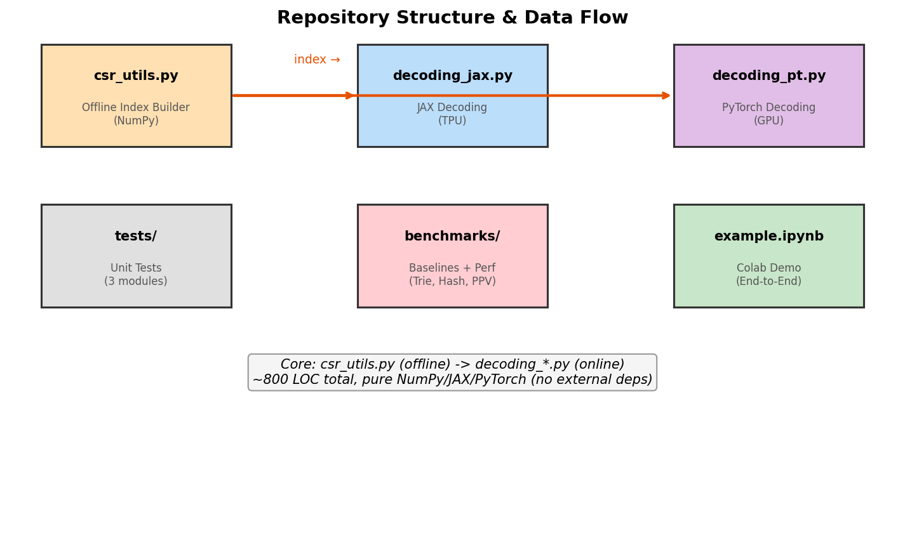

# 5장. 코드 구조 & 실습

---

## 5.1 레포 구조



*[그림 5-1] Repository 구조와 데이터 흐름*

```
static-constraint-decoding/
├── static_decoding/
│   ├── csr_utils.py         # Offline: build_static_index() — ~200 LOC
│   ├── decoding_jax.py      # Online: JAX/TPU 디코딩 — ~250 LOC
│   └── decoding_pt.py       # Online: PyTorch/GPU 디코딩 — ~200 LOC
├── benchmarks/
│   ├── baselines_jax.py     # 3가지 베이스라인 (Trie, Hash, PPV)
│   ├── run_comparative_benchmark_jax.py
│   ├── run_branch_benchmark_jax.py
│   └── run_branch_benchmark_pt.py
├── tests/
│   ├── test_csr_builder.py
│   ├── test_jax_decoding.py
│   └── test_pt_decoding.py
├── example.ipynb            # End-to-End 데모 (Colab)
└── setup.py
```

| 모듈 | LOC | 역할 | 의존성 |
|------|-----|------|--------|
| `csr_utils.py` | ~200 | 인덱스 구축 | NumPy, SciPy |
| `decoding_jax.py` | ~250 | JAX 디코딩 | JAX |
| `decoding_pt.py` | ~200 | PyTorch 디코딩 | PyTorch |
| `baselines_jax.py` | ~300 | 비교 대상 3종 | JAX, NumPy |
| **합계** | **~950** | | |

> 외부 ML 프레임워크 의존 없음. 순수 NumPy + JAX/PyTorch만 사용.

---

## 5.2 핵심 함수 시그니처

### csr_utils.py

```python
def build_static_index(
    fresh_sids: np.ndarray,    # (N, L) sorted semantic IDs
    vocab_size: int = 2048,
    dense_lookup_layers: int = 2,
) -> tuple[
    np.ndarray,   # packed_csr
    np.ndarray,   # indptr
    tuple[int],   # layer_max_branches
    np.ndarray,   # start_mask
    np.ndarray,   # dense_mask
    np.ndarray,   # dense_states
]
```

### decoding_jax.py

```python
def sparse_transition_jax(
    model,              # Callable: (input_ids, key) → (logits, key)
    key,                # JAX PRNG key
    batch_size: int,
    beam_size: int,
    tokens_per_beam: int,
    start_token: int,
    max_sample_len: int,
    vocab_size: int,
    max_branch_factors: tuple[int],
    packed_csr: jnp.ndarray,
    csr_indptr: jnp.ndarray,
    start_mask: jnp.ndarray,
    dense_mask: jnp.ndarray,
    dense_states: jnp.ndarray,
    d_dense: int = 2,
) -> jnp.ndarray  # (batch, beam, max_sample_len)
```

---

## 5.3 example.ipynb 재현

### Step 1: 인덱스 구축

```python
import numpy as np
from static_decoding.csr_utils import build_static_index

V, L, N = 2048, 8, 10_000
rng = np.random.default_rng(42)
sids = np.array(sorted(set(
    tuple(rng.integers(0, V, size=L)) for _ in range(N * 2)
)))[:N]

packed_csr, indptr, branch_factors, start_mask, dense_mask, dense_states = \
    build_static_index(sids, vocab_size=V, dense_lookup_layers=2)
```

### Step 2: Constrained Decoding

```python
from static_decoding.decoding_jax import sparse_transition_jax, RandomModel
import jax, jax.numpy as jnp

model = RandomModel(vocab_size=V)
key = jax.random.PRNGKey(0)

results = sparse_transition_jax(
    model=model, key=key,
    batch_size=2, beam_size=10, tokens_per_beam=10,
    start_token=0, max_sample_len=L, vocab_size=V,
    max_branch_factors=branch_factors,
    packed_csr=jnp.array(packed_csr),
    csr_indptr=jnp.array(indptr),
    start_mask=jnp.array(start_mask),
    dense_mask=jnp.array(dense_mask),
    dense_states=jnp.array(dense_states),
)
# results.shape = (2, 10, 8)
```

### Step 3: 검증

```python
valid_set = set(map(tuple, sids))
decoded = np.array(results)
total = decoded.shape[0] * decoded.shape[1]  # 20
valid = sum(tuple(seq) in valid_set for seq in decoded.reshape(-1, L))
print(f"Valid: {valid}/{total}")  # Valid: 20/20 ✓
```

---

[← 4장](ch04_online_decoding.md) | [목차](../README.md) | [6장 →](../part3/ch06_benchmarks.md)
