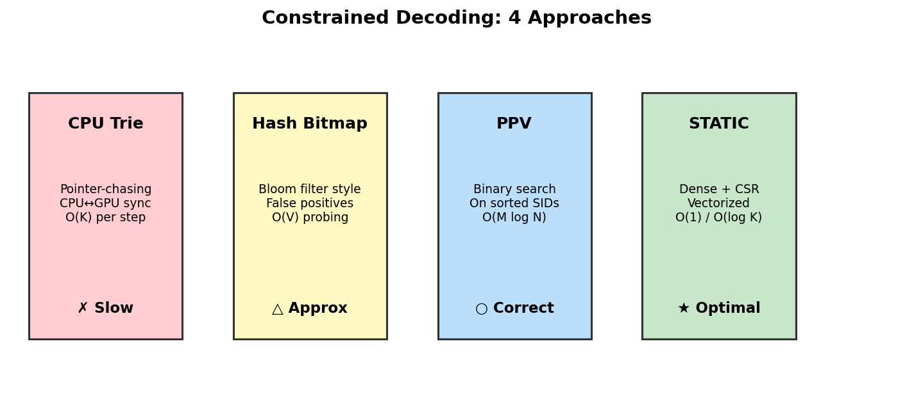
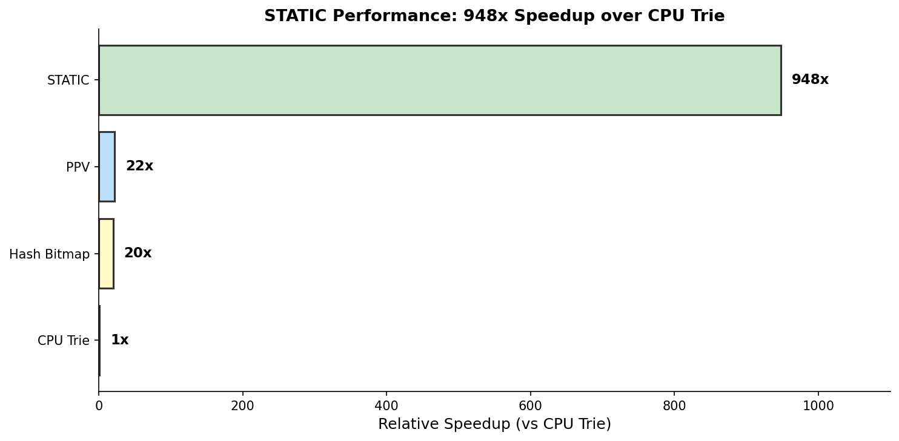
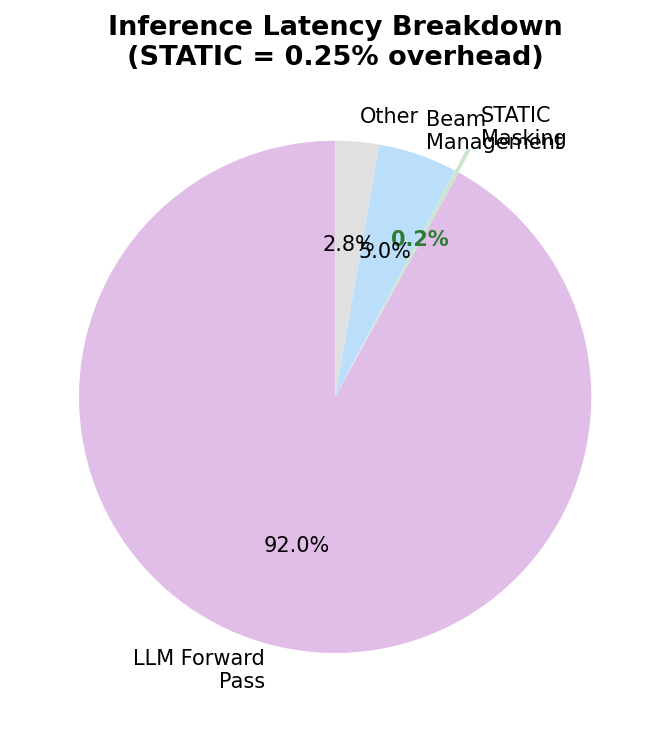

# 6장. 벤치마크 & 베이스라인

---

## 6.1 4가지 Constrained Decoding 방법



*[그림 6-1] 4가지 방법의 특성 비교*

| 방법 | 자료구조 | 실행 위치 | 복잡도 | 정확성 |
|------|---------|----------|--------|--------|
| **CPU Trie** | 딕셔너리 | CPU (callback) | O(V) + sync | 정확 |
| **Hash Bitmap** | Bloom filter | GPU/TPU | O(V) probing | **오검출 있음** |
| **PPV** | Sorted array | GPU/TPU | O(M log N) | 정확 |
| **STATIC** | Dense + CSR | GPU/TPU | O(1) / O(log K) | 정확 |

### CPU Trie (baselines_jax.py)

```python
# 매 스텝마다:
# 1. GPU → CPU: 현재 beam 상태 전송
# 2. CPU: 딕셔너리 탐색으로 유효 토큰 계산
# 3. CPU → GPU: 마스크 전송
# → jax.pure_callback() 사용, 동기화 오버헤드 큼
```

### Hash Bitmap

```python
# 전처리: 모든 (prefix, next_token) 해시 → 2^30 비트 배열
# 디코딩: hash(current_prefix, candidate) → 비트 확인
# 문제: 해시 충돌 → false positive (유효하지 않은 토큰을 허용)
```

### PPV (Parallel Prefix Verification)

```python
# 정렬된 SID 배열에서 binary search
# 1. prefix 범위 탐색: O(log N)
# 2. 각 후보 토큰 검증: O(log N)
# 3. top-M 후보만 검증 → O(M log N)
```

---

## 6.2 성능 결과



*[그림 6-2] CPU Trie 대비 상대 속도*

| 방법 | 스텝당 지연 | CPU Trie 대비 | PPV 대비 |
|------|-----------|-------------|---------|
| CPU Trie | ~31.3ms | 1x | - |
| Hash Bitmap | ~1.5ms | ~20x | ~1x |
| PPV | ~1.4ms | ~22x | 1x |
| **STATIC** | **0.033ms** | **948x** | **47x** |

> STATIC은 PPV 대비 **47 ~ 1,033x** 빠름 (분기 수에 따라 차이)

---

## 6.3 Latency Breakdown



*[그림 6-3] 전체 추론 시간 중 STATIC 마스킹 비중*

| 구성 요소 | 비중 |
|----------|------|
| LLM Forward Pass | 92% |
| Beam Management | 5% |
| Other | 2.75% |
| **STATIC Masking** | **0.25%** |

> 마스킹 오버헤드가 0.25%이므로 **사실상 무료(free)**

---

## 6.4 확장성

| 파라미터 | 범위 | STATIC 영향 |
|---------|------|------------|
| N (아이템 수) | 10K → 10M | 인덱스 크기 증가, **디코딩 시간 불변** |
| V (vocab size) | 512 → 8,192 | Dense 테이블 크기 선형 증가 |
| L (sequence length) | 4 → 16 | 디코딩 스텝 수 선형 증가 |
| beam_size | 1 → 100 | 배치 차원 선형 증가 |

> **핵심**: 아이템 수 N이 늘어나도 디코딩 시간은 변하지 않음.
> CSR의 burst-read는 해당 상태의 분기 수 K에만 의존.

---

[← 5장](../part2/ch05_code_walkthrough.md) | [목차](../README.md) | [7장 →](../part4/ch07_application.md)
