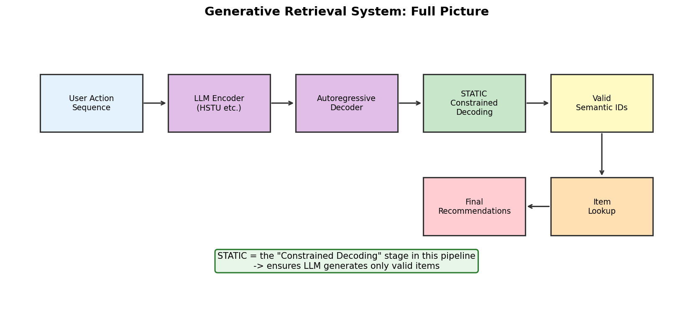

# 7장. 실무 적용 & 확장

---

## 7.1 Generative Retrieval 전체 그림



*[그림 7-1] Generative Retrieval 시스템에서 STATIC의 위치*

STATIC은 Generative Retrieval 파이프라인의 **Constrained Decoding 단계**를 담당합니다.

| 단계 | 역할 | 관련 기술 |
|------|------|----------|
| User Encoding | 유저 행동 시퀀스를 벡터로 인코딩 | HSTU, SASRec, Transformer |
| Autoregressive Decoding | LLM이 Semantic ID를 토큰 단위로 생성 | Beam Search |
| **Constrained Decoding** | **유효한 토큰만 선택하도록 마스킹** | **STATIC** |
| ID → Item Mapping | Semantic ID → 실제 아이템 룩업 | Hash Table |

---

## 7.2 HSTU와의 연결

이전 스터디(Meta Generative Recommenders)에서 학습한 HSTU는 **User Encoder** 역할:

```
┌──────────────────────────────────────────────────────┐
│  Meta HSTU (1순위 스터디)                              │
│  → User action sequence encoding                      │
│  → STU Layer × N                                      │
│  → Multi-task learning                                │
└──────────────┬───────────────────────────────────────┘
               ↓
┌──────────────────────────────────────────────────────┐
│  Autoregressive Decoder                               │
│  → Semantic ID 토큰을 하나씩 생성                      │
└──────────────┬───────────────────────────────────────┘
               ↓
┌──────────────────────────────────────────────────────┐
│  YouTube STATIC (4순위 스터디)                         │
│  → 유효한 아이템만 생성하도록 constrained decoding      │
│  → Dense + CSR 하이브리드, 0.25% 오버헤드              │
└──────────────────────────────────────────────────────┘
```

| 스터디 | 역할 | 연결점 |
|--------|------|--------|
| 1순위 Meta HSTU | User Encoder | HSTU 출력 → Decoder 입력 |
| 3순위 NVIDIA | 프로덕션 확장 | DynamicEmb로 Semantic ID 관리 |
| **4순위 YouTube STATIC** | **Constrained Decoding** | **Decoder 출력 제약** |

---

## 7.3 적용 시나리오

### 시나리오 1: 실시간 추천 필터링

```
전체 아이템 카탈로그 (N=10M)
  → 비즈니스 필터 적용 (freshness, category, policy)
  → 부분 집합 (N'=2M)
  → build_static_index(filtered_sids)  ← 배치 갱신
  → sparse_transition() 로 constrained decoding
```

### 시나리오 2: A/B 테스트별 제약

| 실험군 | 제약 조건 | STATIC 인덱스 |
|--------|----------|-------------|
| Control | 전체 카탈로그 | index_full |
| Treatment A | 최근 7일만 | index_fresh |
| Treatment B | 특정 카테고리만 | index_category |

> 인덱스만 교체하면 동일 LLM으로 다른 비즈니스 로직 적용 가능

### 시나리오 3: Cold-start 아이템 제어

```
새 아이템 등록 → Semantic ID 할당
  → 기존 인덱스에 추가 (재구축 필요)
  → 또는 delta index로 병합 (향후 연구)
```

---

## 7.4 한계 & 고려사항

| 한계 | 설명 | 대응 |
|------|------|------|
| 인덱스 재구축 비용 | 아이템 변경 시 전체 인덱스 재생성 | 배치 스케줄 (시간/일 단위) |
| Semantic ID 생성 | RQ-VAE 등 별도 파이프라인 필요 | 이 레포 범위 밖 |
| 메모리 | CSR 인덱스가 GPU 메모리 상주 | N=10M, L=8 기준 ~100MB |
| 동적 제약 | 실시간 필터 변경은 인덱스 재구축 필요 | 여러 인덱스 사전 구축 |

---

## 7.5 정리: 4개 스터디 연결

| # | 스터디 | 파이프라인 위치 | 핵심 기여 |
|---|--------|--------------|----------|
| 1 | Meta HSTU | User Encoder | 시퀀스 → 임베딩, 생성형 추천 |
| 2 | MS Recommenders | 평가 프레임워크 | 20+ 메트릭, A/B 프레임워크 |
| 3 | NVIDIA recsys-examples | 프로덕션 인프라 | DynamicEmb, 분산 학습, 서빙 |
| 4 | **YouTube STATIC** | **Constrained Decoding** | **유효 아이템 보장, 948x 속도** |

---

[← 6장](../part3/ch06_benchmarks.md) | [목차](../README.md)
